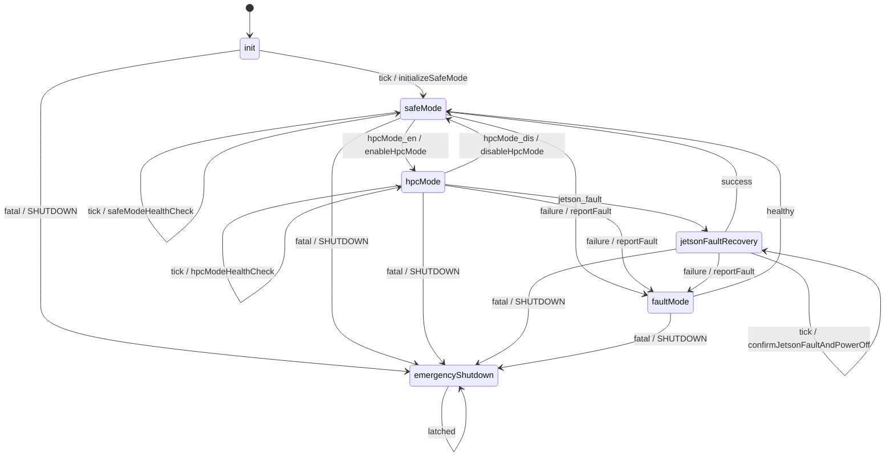
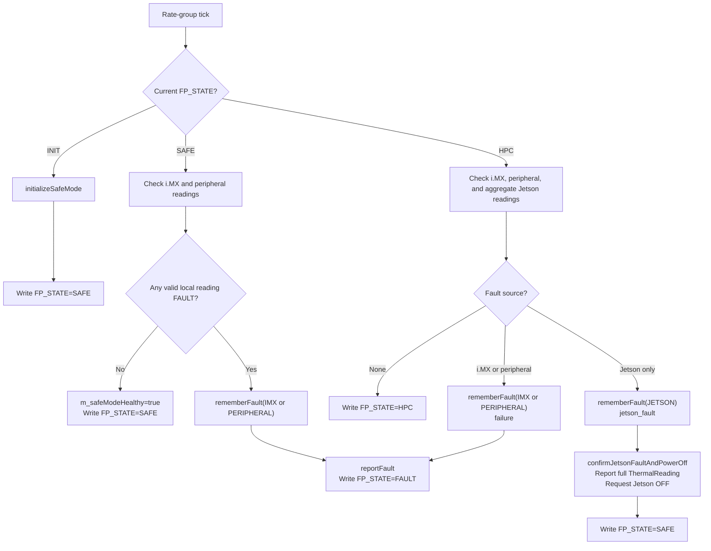
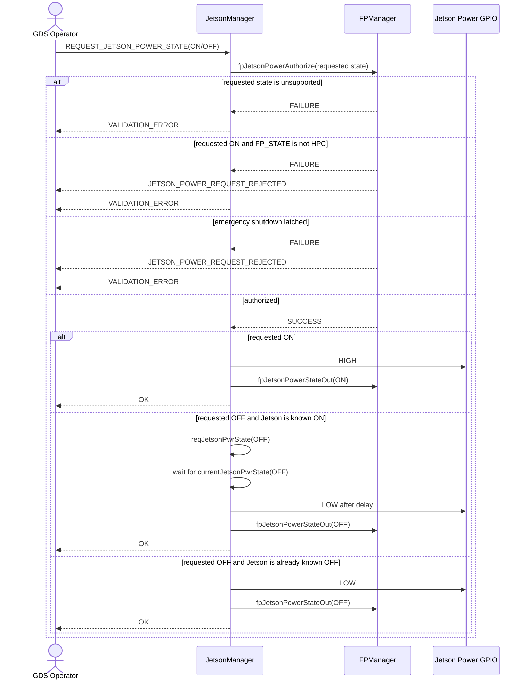
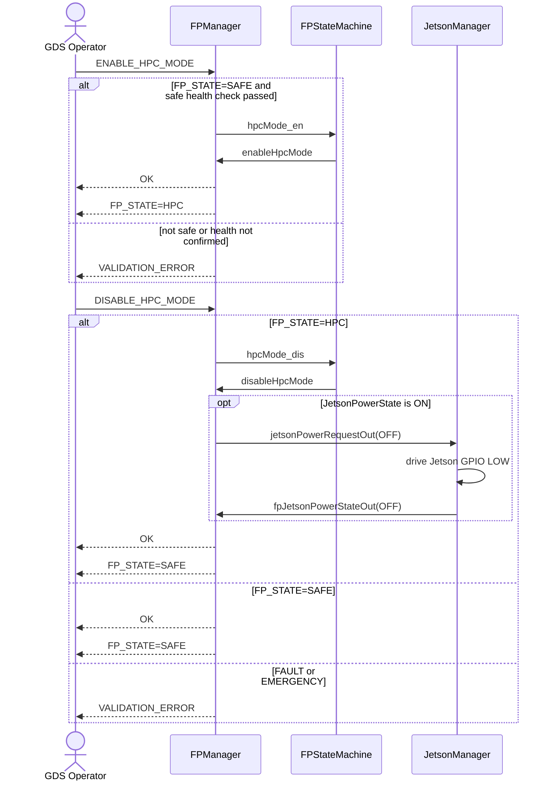
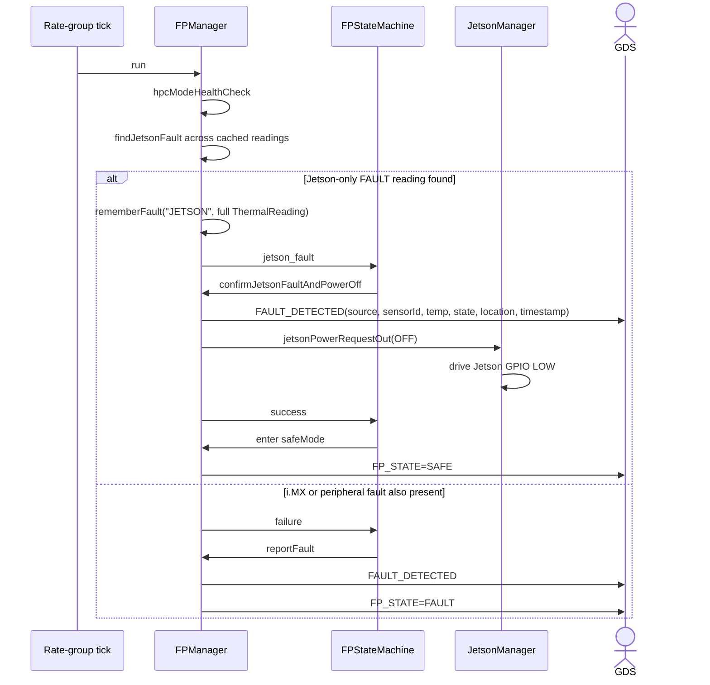
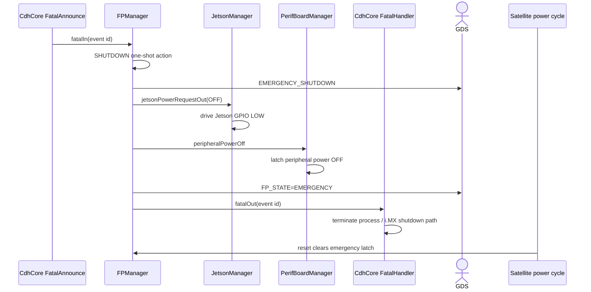

# scalesSvc::FPManager

Fault Protection Manager for the SCALES system. FPManager owns the system-level
flight-processor protection state machine and gates Jetson power requests based
on that state.

This document records the implemented component design, interfaces, state
transitions, and verification status.

## Design Summary

FPManager receives complete `ThermalReading` values from the thermal managers.
It evaluates the `tempState` field, while retaining the complete reading so a
fault report can identify the sensor (`sensorId`, `location`, and timestamp)
that caused the transition.

Jetson readings are aggregated in FPManager because the sensors share the same
die. A Jetson fault is asserted when any valid Jetson reading has
`ThermalStates.FAULT`; JetsonThermalManager is not responsible for this
system-level aggregation.

The Jetson is not permitted to be powered on by command in Safe Mode. A Jetson
power-on request is accepted only in HPC Mode. `DISABLE_HPC_MODE` returns the
system to Safe Mode, requests Jetson OFF, and republishes `FP_STATE=SAFE`.
Startup Safe Mode does not issue a one-shot Jetson OFF request; active Jetson
OFF requests remain available for operator disable, protection, and recovery
actions.

`$fatal` is an emergency override. FPManager performs the one-shot protection
action before forwarding the fatal event to the standard fatal handler. The
action emits the high-priority shutdown event, synchronously requests Jetson
and peripheral power removal, and latches `emergencyShutdown`. It does not
transition through `faultMode` and has no recovery transition; the standard
fatal handler then performs the process/i.MX shutdown and the satellite power
cycle resets the system.

## Usage Examples

The intended lifecycle is shown in the state-machine diagram below. Any state
can receive `$fatal` and enter `emergencyShutdown`.



### Diagrams

The state machine is defined in `FPStateMachine.fpp`. The Jetson fault-recovery
and emergency-shutdown sequences below describe the component-level behavior.

#### Component Relationships

```mermaid
flowchart LR
    ImxThermalManager["ImxThermalManager"]
    McpManager["McpManager / local thermal sources"]
    Hub["GenericHub serial channels"]
    JetsonThermal["Jetson thermal readings"]
    JetsonManager["JetsonManager"]
    PerifBoardManager["PerifBoardManager"]
    FatalAdapter["CdhCore FatalAnnounce"]
    FatalHandler["CdhCore FatalHandler"]
    FPManager["FPManager"]
    GDS["GDS / CdhCore telemetry, events, commands"]

    ImxThermalManager -->|ThermalReading| FPManager
    McpManager -->|ThermalReading sensor 1/2| FPManager
    JetsonThermal --> Hub
    Hub -->|serialOut[4] ThermalReading| FPManager

    GDS -->|ENABLE_HPC_MODE / DISABLE_HPC_MODE| FPManager
    GDS -->|REQUEST_JETSON_POWER_STATE| JetsonManager
    JetsonManager -->|fpJetsonPowerAuthorize| FPManager
    JetsonManager -->|fpJetsonPowerStateOut| FPManager
    FPManager -->|jetsonPowerRequestOut OFF| JetsonManager
    FPManager -->|peripheralPowerOff| PerifBoardManager

    FatalAdapter -->|fatalIn| FPManager
    FPManager -->|fatalOut| FatalHandler
    FPManager -->|FP_STATE / JETSON_VALID_READING_COUNT / events| GDS
```

#### Health Evaluation



#### Jetson Power Authorization



#### HPC Enable And Disable



### Typical Usage

1. On the first scheduler tick, initialize FPManager in Safe Mode and gate
   Jetson ON commands.
2. In Safe Mode, evaluate i.MX and peripheral readings and keep Jetson power-on
   commands gated.
3. After a Safe Mode health check passes, `ENABLE_HPC_MODE` may transition to
   HPC Mode. HPC Mode evaluates i.MX, peripheral, and Jetson readings on each
   tick; Jetson ON commands remain gated by the resulting state.
4. While still in HPC Mode, operators may command `REQUEST_JETSON_POWER_STATE`
   to `OFF` to use the graceful-ish Jetson shutdown path.
5. `DISABLE_HPC_MODE` may transition from HPC Mode back to Safe Mode. The
   transition requests direct Jetson OFF if Jetson is still known ON and updates
   `FP_STATE` to `SAFE`, causing subsequent Jetson ON requests to be rejected
   again.
6. If only the Jetson is faulty, record the offending full reading, power off
   the Jetson, report the cause, and return to Safe Mode.
7. If i.MX or peripheral health fails, enter Fault Mode and report the stored
   reading that caused the failure.

## Implementation Progress

- [x] Define initialization, Safe Mode, HPC Mode, Jetson fault recovery, Fault
  Mode, and terminal Emergency Shutdown states.
- [x] Define the first-tick Safe Mode initialization behavior.
- [x] Define Jetson aggregate-fault behavior using full thermal readings.
- [x] Define the Jetson power-on gating boundary at HPC Mode.
- [x] Add an operator command to disable HPC Mode, power off Jetson, and return
  to Safe Mode.
- [x] Add full thermal-reading input ports to `FPManager`.
- [x] Add cached reading storage and Jetson sensor aggregation.
- [x] Add gated Jetson power request handling and command rejection events.
- [x] Add fault-cause events/telemetry for the stored `ThermalReading`.
- [x] Instantiate and drive `FPStateMachine` from `FPManager`.
- [x] Wire local i.MX and MCP thermal readings into FPManager.
- [x] Add the upstream fatal-announcement input to the terminal shutdown path.
- [x] Transport the nine Jetson readings across hub serial channel 4 into FPManager.
- [x] Keep `REQUEST_JETSON_POWER_STATE` in JetsonManager while synchronously
  authorizing it through FPManager before GPIO or hub activity.
- [x] Make FP recovery and emergency Jetson power-off requests synchronous so
  protection GPIO actions are not left behind in a queue.
- [x] Make peripheral emergency power-off synchronous and latched.
- [x] Add FPManager unit tests for Safe Mode, HPC gating, Jetson recovery, and
  fatal shutdown. Runtime execution requires an ARM64 target or emulator.

## Component Relationships

The deployment topology connects thermal managers to FPManager, JetsonManager
to the synchronous power authorization gate, and FPManager protection outputs
to JetsonManager and PerifBoardManager. JetsonManager also reports its last
Jetson power state to `jetsonPowerStateIn`, allowing FPManager to request
Jetson OFF during `DISABLE_HPC_MODE` only when the Jetson is known ON. The
authoritative port wiring is in `ImxDeployment/Top/topology.fpp`.

## Port Descriptions
| Name | Description |
|---|---|
| Thermal reading inputs | Full `ThermalReading` values from i.MX, MCP/local peripheral, and Jetson sources. Jetson input is multi-reading and aggregated by sensor ID. |
| Jetson power authorization | Synchronous gate called by JetsonManager before executing `REQUEST_JETSON_POWER_STATE`. |
| Internal power output | Synchronous OFF request to JetsonManager for recovery and emergency protection; it drives the Jetson GPIO LOW immediately. |
| Peripheral emergency output | Synchronous, latched OFF request that holds the peripheral board power down. |
| Rate-group tick | Drives initialization and periodic health checks. |

## Component States
| Name | Description |
|---|---|
| `init` | Startup state. The first tick initializes Safe Mode. |
| `safeMode` | Jetson power-on is gated; i.MX and peripheral health are checked. |
| `hpcMode` | HPC enabled; i.MX, peripheral, and aggregate Jetson thermal health are checked. Jetson ON commands are authorized only here. |
| `jetsonFaultRecovery` | Confirms and reports a Jetson fault, powers off Jetson, then returns to Safe Mode. |
| `faultMode` | Reports non-recoverable i.MX/peripheral or general protection faults. |
| `emergencyShutdown` | Terminal state for `$fatal`; performs the one-shot shutdown before fatal handling is forwarded. |

## Sequence Diagrams

### Jetson Fault Recovery



### Emergency Shutdown



## Parameters
| Name | Description |
|---|---|
|---|---|

## Commands
| Name | Description |
|---|---|
| HPC mode enable | Requests transition from Safe Mode to HPC Mode. The request is accepted only after Safe Mode health checks pass. |
| HPC mode disable | Requests transition from HPC Mode back to Safe Mode. If Jetson is known ON, the request powers it off through the FPManager protection path and republishes `FP_STATE=SAFE`. |
| Jetson power request | Requests Jetson power changes. ON is gated to HPC Mode; OFF is always permitted. |

## Events
| Name | Description |
|---|---|
| Fault detected | Reports the failing subsystem and, for thermal faults, the complete source reading. |
| Emergency shutdown | High-priority warning emitted when `$fatal` causes the terminal shutdown action. |

## Telemetry
| Name | Description |
|---|---|
| `FP_STATE` | Current FPManager state enum (`INIT`, `SAFE`, `HPC`, `FAULT`, or `EMERGENCY`). Written on state transitions and steady Safe/HPC health-check ticks. |
| `JETSON_VALID_READING_COUNT` | Number of Jetson sensor IDs with valid cached readings. |

## Unit Tests
| Name | Description | Output | Coverage |
|---|---|---|---|
| `initializesSafeModeAndGatesJetsonOn` | First tick initializes Safe Mode and rejects a Jetson ON authorization request. | `FAILURE`, no startup Jetson OFF request, rejection event | FP-001, FP-002, FP-003 |
| `entersHpcModeAndAcceptsJetsonOn` | Enables HPC Mode and permits a Jetson ON authorization request. | `SUCCESS` and no rejection event | FP-003 |
| `disablesHpcModeAndGatesJetsonOn` | Tracks Jetson ON, disables HPC Mode, requests Jetson OFF, republishes `SAFE`, and rejects a later Jetson ON authorization request. | Jetson OFF, `FP_STATE=SAFE`, authorization failure | FP-002, FP-003, FP-009 |
| `attributesJetsonFaultAndReturnsSafe` | Aggregates the nine Jetson sensor readings, identifies sensor 4, reports its full reading, powers off the Jetson, and returns to Safe Mode. | Fault event with source, sensor ID, temperature, state, location, and timestamp; Jetson OFF | FP-004, FP-005 |
| `fatalShutdownForwardsAndLatches` | Routes `$fatal` to the terminal emergency shutdown path, forwards the fatal event, emits emergency shutdown, powers down protected devices, and rejects later Jetson ON requests. | Fatal forwarding, shutdown event, Jetson OFF, peripheral OFF, authorization failure | FP-007, FP-008 |

The FPManager UT target is built with `fprime-util generate imx8x --ut --disable-sanitizers`; execution requires an ARM64 target or an AArch64 emulator.

## Requirements
| Name | Description | Validation |
|---|---|---|
| FP-001 | The first tick after startup shall initialize the system in Safe Mode. | `initializesSafeModeAndGatesJetsonOn` |
| FP-002 | Safe Mode shall reject Jetson power-on commands until HPC Mode is enabled. | `initializesSafeModeAndGatesJetsonOn` |
| FP-003 | Jetson power-on shall be accepted only in HPC Mode. | `initializesSafeModeAndGatesJetsonOn`, `entersHpcModeAndAcceptsJetsonOn` |
| FP-004 | Any Jetson `ThermalStates.FAULT` reading shall assert the Jetson fault condition. | `attributesJetsonFaultAndReturnsSafe` |
| FP-005 | Jetson fault recovery shall preserve and report the offending full `ThermalReading`. | `attributesJetsonFaultAndReturnsSafe` |
| FP-006 | i.MX or peripheral faults shall enter Fault Mode. | State-machine test coverage pending |
| FP-007 | `$fatal` shall immediately enter terminal Emergency Shutdown and shall not enter Fault Mode. | `fatalShutdownForwardsAndLatches` |
| FP-008 | Emergency Shutdown shall power off all protected devices and rely on satellite power cycling for reset. | `fatalShutdownForwardsAndLatches`; deployment-level power-cycle test remains pending |
| FP-009 | Disabling HPC Mode shall request Jetson OFF when Jetson is known ON, return FPManager to Safe Mode, and re-gate Jetson ON requests. | `disablesHpcModeAndGatesJetsonOn` |

## Change Log
| Date | Description |
|---|---|
| 2026-07-21 | Documented initial FP state-machine design and implementation checkpoints. |
| 2026-07-21 | Implemented FPManager interfaces, reading cache/aggregation, local thermal wiring, and protection actions. |
| 2026-07-21 | Wired the nine Jetson thermal readings through GenericHub serial channel 4 into FPManager. |
| 2026-07-21 | Added synchronous Jetson power authorization, synchronous internal recovery/shutdown power paths, latched peripheral shutdown, and fatal-handler forwarding. |
| 2026-07-21 | Required a completed Safe Mode health-check action before accepting `ENABLE_HPC_MODE`; updated unit-test sequencing and verification notes. |
| 2026-07-22 | Made steady Safe/HPC health checks republish `FP_STATE` so GDS can observe FPManager after startup. |
| 2026-07-22 | Changed `FP_STATE` telemetry from raw `U8` to the `FPManagerState` enum for labeled GDS display. |
| 2026-07-22 | Added `DISABLE_HPC_MODE` to power off Jetson when needed, return to Safe Mode, and re-gate Jetson ON requests. |
| 2026-07-22 | Removed the startup Jetson OFF request from Safe Mode initialization; active Jetson OFF is reserved for recovery and emergency paths. |
| 2026-07-22 | Added Mermaid diagrams for FPManager state transitions, component relationships, health evaluation, Jetson power authorization, HPC control, Jetson fault recovery, and emergency shutdown. |
| 2026-07-22 | Documented graceful commanded Jetson OFF while keeping FPManager disable, recovery, and emergency OFF direct. |
