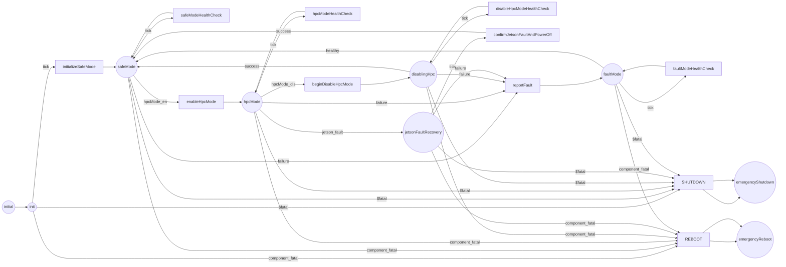
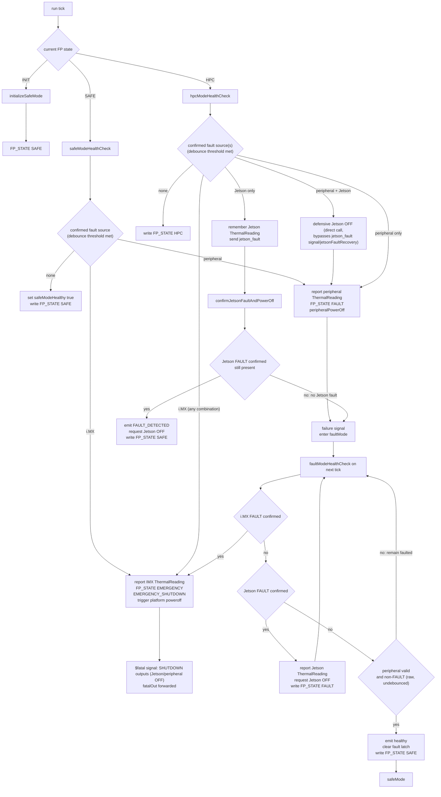
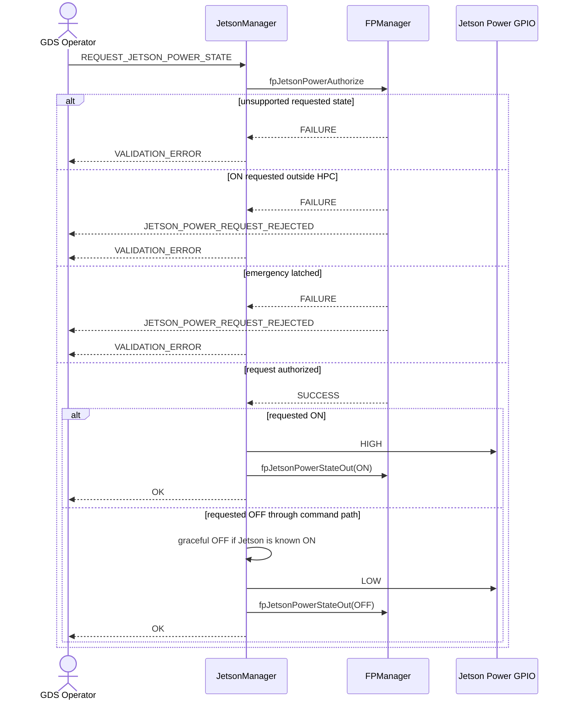
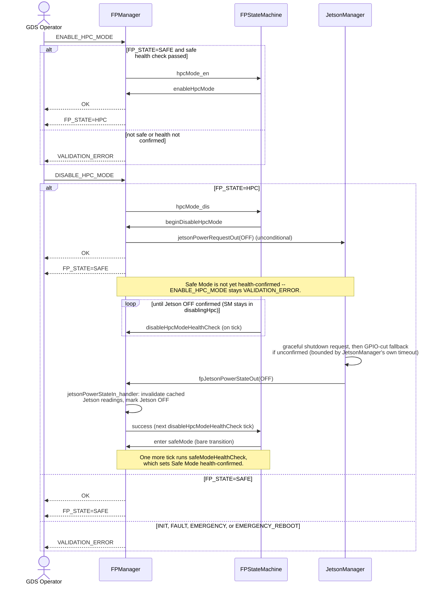
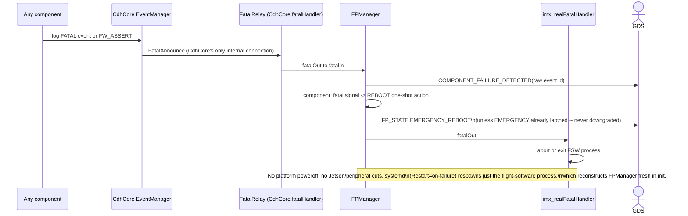

# scalesSvc::FPManager

Fault Protection Manager for the SCALES system. FPManager owns the system-level
flight-processor protection state machine and gates Jetson power requests based
on that state.

This document records the implemented component design, interfaces, state
transitions, and verification status.

## Design Summary

FPManager receives complete `ThermalReading` values from the thermal managers.
It evaluates the `tempState` field, while retaining the complete reading so a
fault report can identify the sensor (`sensorId`, `location`, and timestamp)
that caused the transition.

Peripheral fault recovery is health-gated. After a peripheral fault enters
`faultMode`, FPManager checks the cached readings on every rate-group tick. It
remains in `FAULT` while the peripheral reading is missing or still
`ThermalStates.FAULT`, or while any cached Jetson reading is still
`ThermalStates.FAULT`. A Jetson fault detected while already in Fault Mode is
reported and requests Jetson OFF defensively, but remains a non-system-fatal
Fault Mode condition. Once the peripheral reading is valid and outside `FAULT`,
no Jetson fault is cached, and no i.MX fault is present, FPManager emits the
internal `healthy` signal, clears the fault latch, and transitions to Safe
Mode. A new i.MX `FAULT` during this recovery check still uses the global
Emergency Shutdown path.

Jetson readings are aggregated in FPManager because the sensors share the same
die. A Jetson fault is asserted when any valid Jetson reading has
`ThermalStates.FAULT`; JetsonThermalManager is not responsible for this
system-level aggregation. While FPManager is in HPC Mode, a newly received
Jetson `FAULT` reading immediately asserts the Jetson fault signal; the system
does not need to wait for the next FPManager health-check tick.
Whenever FPManager commands or observes Jetson `OFF`, it invalidates the cached
Jetson readings and writes `JETSON_VALID_READING_COUNT=0`. This prevents a
pre-shutdown Jetson `FAULT` reading from being reused when the operator later
re-enters HPC Mode; a new Jetson fault requires a new reading after power-on.

FPManager also tracks `ThermalStates.WARN` for each fault domain purely for
operator awareness -- unlike `FAULT`, entering or exiting `WARN` triggers no
protective action at all. i.MX and peripheral each have their own one-shot
latch (`m_imxWarnActive`, `m_peripheralWarnActive`); Jetson uses a single
aggregate latch (`m_jetsonWarnActive`) across all nine sensors, mirroring how
Jetson `FAULT` is already aggregated, since the sensors share the same die.
The check runs directly inside each reading handler
(`imxThermalReadingIn_handler`, `peripheralThermalReadingIn_handler`,
`jetsonThermalReadingIn_handler`) as soon as a new reading arrives -- it does
not wait for the next health-check tick the way `FAULT` handling for i.MX and
peripheral does. `WARN_STATE_ENTERED` is emitted on the transition into
`WARN` from any other state; `WARN_STATE_EXITED` is emitted on the transition
out of `WARN`, whether that's recovery to `IDLE`, escalation to `FAULT`, or
the reading becoming unavailable (`NOT_USED`). Repeated `WARN` readings do
not re-emit `WARN_STATE_ENTERED`, and the Jetson aggregate only exits `WARN`
once every cached Jetson reading has left `WARN`. This is a read-only
observability layer: it never sets `FP_STATE`, never asserts a protection
output, and is completely independent of the `FPStateMachine` and the
SAFE/HPC/FAULT/EMERGENCY mode -- it keeps tracking regardless of what mode
FPManager itself is in.

The Jetson is not permitted to be powered on by command in Safe Mode. A Jetson
power-on request is accepted only in HPC Mode. `DISABLE_HPC_MODE` requests
Jetson OFF unconditionally and immediately republishes `FP_STATE=SAFE`, which
re-gates new HPC entry and new Jetson ON authorization right away -- but
FPManager does not consider Safe Mode *health-confirmed* (`ENABLE_HPC_MODE`
stays `VALIDATION_ERROR`) until JetsonManager reports a real, confirmed
Jetson OFF back through `jetsonPowerStateIn`. The intermediate `disablingHpc`
state exists to wait for that confirmation: it never optimistically declares
the Jetson off or invalidates its cached thermal readings the instant OFF is
requested, since the Jetson is not actually confirmed off until JetsonManager
either receives its own graceful shutdown acknowledgment or falls back to
cutting GPIO power after its own bounded timeout (`JetsonManager`'s
`CMD_TIMEOUT_TICKS`/`JETSON_POWER_OFF_DELAY_TICKS`). Declaring the Jetson off
before that confirmation previously raced the still-alive Jetson (mid-reboot,
still sending hub traffic) against the newly-invalidated reading cache and a
premature Safe Mode transition, which could overflow the hub's `Svc::ComQueue`
and trip a FATAL `FW_ASSERT` -- see the Change Log entry for the fix. Startup
Safe Mode does not issue a one-shot Jetson OFF request; active Jetson OFF
requests remain available for operator disable, protection, and recovery
actions.

Remote Jetson deployment commands are also gated on the i.MX before they reach
the hub transport. There are two independent remote command sources in the
topology -- `imx_cmdSplitter` (GDS-direct commands) and `imx_seqCmdSplitter`
(commands issued by a running `CmdSequencer` sequence, e.g. `CS_RUN`) -- and
both are routed through the *same* gate: `remoteJetsonCmdIn`/
`remoteJetsonCmdOut`/`remoteJetsonCmdResponseIn`/`remoteJetsonCmdResponseOut`
are `[2]`-sized arrays, with index 0 wired to `imx_cmdSplitter` and index 1
wired to `imx_seqCmdSplitter`. `remoteJetsonCmdIn_handler` and
`remoteJetsonCmdResponseIn_handler` thread the `portNum` argument straight
through to the matching output index, so one handler implementation gates
both sources identically -- there is no separate code path per source. If the
last reported Jetson power state is `OFF`, FPManager rejects the command
locally with `Fw.CmdResponse.BUSY` and emits
`REMOTE_JETSON_COMMAND_REJECTED`. This prevents commands such as
`JetsonThermalManager` parameter updates -- issued directly from GDS or from a
sequence -- from being transmitted into the hub while the Jetson is powered
off or the hub link is unavailable. If the Jetson is known `ON`, FPManager
forwards the command to GenericHub and passes the remote command response
back to the originating CmdSplitter unchanged.

Before this gate covered both sources, a sequence targeting the Jetson (e.g.
`run-ml.bin`, which issues `JetsonDeployment.jetson_mlManager.*` commands)
while the Jetson was powered off would route straight from
`imx_seqCmdSplitter.RemoteCmd[0]` to `imx_hub.cmdDispIn[1]` with no gating at
all, reach `imx_hubComStub.dataIn_handler` with the TCP link never
established, and trip `FW_ASSERT(!this->m_reinitialize ||
!this->isConnected_comStatusOut_OutputPort(0))` in
`lib/fprime/Svc/ComStub/ComStub.cpp` -- crashing the whole flight software
process instead of being rejected gracefully. Routing `imx_seqCmdSplitter`
through the same FPManager gate as `imx_cmdSplitter` fixes this.

`$fatal` is an emergency override. CdhCore's `EventManager.FatalAnnounce` and
`Svc.FatalHandler.FatalReceive` are both scalar (non-array) ports, and
CdhCore's subtopology always wires them together internally, so a deployment
cannot add a second consumer of `FatalAnnounce` directly. `ImxDeployment`
works around this with `scalesSvc.FatalRelay`
(`CdhCoreFatalHandlerConfig.fpp`), a minimal passive component swapped in as
CdhCore's `fatalHandler` instance: it exposes a `FatalReceive` port to satisfy
CdhCore's internal wiring, then re-announces the event on a fresh `fatalOut`
port that is free to route anywhere. The real path is
`EventManager.FatalAnnounce -> FatalRelay.FatalReceive -> FatalRelay.fatalOut
-> FPManager.fatalIn -> FPManager.fatalOut -> imx_realFatalHandler.FatalReceive`
(a separate `Svc.FatalHandler` instance dedicated to actually terminating the
process). See `ImxDeployment/Top/topology.fpp` and
`ImxDeployment/SubtopologyConfig/CdhCoreFatalHandlerConfig.fpp`.

`fatalIn_handler` is split from the i.MX thermal shutdown path it used to
share. `Svc.FatalEvent` (the port type `fatalIn`/`fatalOut` carry) is
`fatalIn_handler(FwIndexType portNum, FwEventIdType Id)` -- it carries only
the raw numeric event ID (component base ID + local event ID), never a
sensor, device, or component name. `fatalIn_handler` logs
`COMPONENT_FAILURE_DETECTED` with that raw ID (resolve it against the GDS
event dictionary to identify the failing component), sends the
`component_fatal` signal -- which latches `FP_STATE=EMERGENCY_REBOOT` through
the `REBOOT` action, asserting no hardware output and cutting no power -- and
forwards to `imx_realFatalHandler` via `fatalOut` exactly as before. That
handler aborts the process; because `ImxDeployment` is a systemd service with
`Restart=on-failure`, this already respawns just the flight-software process,
reconstructing FPManager fresh in `init`. No new reboot/poweroff mechanism is
implemented here -- the fix was removing a premature platform poweroff from
this path, not adding a new restart path. This path is forward-looking
hardening: no component in `scalesSvc` defines a FATAL event today.

Full platform shutdown (`FP_STATE=EMERGENCY`, the protected-output shutdown,
and `triggerPlatformPoweroff()`) is now reserved exclusively for a
*confirmed* i.MX thermal `FAULT` -- see `triggerImxEmergencyShutdown` and
"Platform Poweroff" below. `component_fatal` never downgrades an
already-latched `EMERGENCY`: the `REBOOT` action returns immediately if
`m_mode == FPManagerState::EMERGENCY`, since a component FATAL arriving after
a real platform shutdown has already latched must never misrepresent an
active poweroff as a mere FSW restart. `emergencyShutdown` and
`emergencyReboot` are both terminal with no recovery transition; FPManager
does not transition through `faultMode` on either `$fatal` or
`component_fatal`.

### Fault Debounce

Every `ThermalStates.FAULT` check that can trigger a protective action --
i.MX, peripheral, and each of the nine Jetson zones independently -- is
gated by a GDS-settable `FAULT_DEBOUNCE_COUNT` parameter (default 3): a
source's FAULT must be read this many consecutive times before FPManager
treats it as *confirmed* and acts on it. At the 2-second rate-group period, a
value of N delays action by roughly `(N-1)*2` seconds of sustained fault. 0
and 1 are equivalent and mean "act on the first FAULT reading," matching
pre-debounce behavior.

Streaks are tracked per **input source**, not per fault domain, because two
independent producers write the same cached i.MX reading --
`ImxThermalManager` (the CPU die, via `imxThermalReadingIn`) and
`McpManager`'s sensor 1 (the OBC board sensor, via `mcpThermalReadingIn`) --
and peripheral has the same two-source shape (`peripheralThermalReadingIn`
plus `mcpThermalReadingIn` sensor 2, though only the MCP path is wired in the
topology today). A single shared per-domain counter would be reset by
whichever source is currently healthy, silently masking a sustained real
fault from the other source feeding the same cache. FPManager tracks four
independent source streaks (`SRC_IMX_LOCAL`, `SRC_IMX_MCP`,
`SRC_PERIF_LOCAL`, `SRC_PERIF_MCP`) plus one streak per Jetson zone, and
remembers which source most recently wrote each cached i.MX/peripheral
reading (`m_imxLastSource`/`m_peripheralLastSource`) so the "is this domain's
cached reading a confirmed fault" check consults the right source's streak.

Each streak saturates at `FAULT_DEBOUNCE_MAX` (1000, roughly 33 minutes of
sustained fault) rather than at the currently active threshold, so raising
the threshold via a live `PRM_SET` can never strand an already-saturated
streak below the new value. A streak resets to zero on any non-FAULT
reading, *including* an unavailable/`NOT_USED` reading -- consistent with how
invalid readings are already treated everywhere else in this component, and
necessary so a stale streak from before a gap or a Jetson power-off cannot
trip immediately once real readings resume. Jetson streaks are explicitly
cleared by `invalidateJetsonReadings()` alongside the reading cache, for the
same reason.

Debounce gates entry into a protective action; it never gates exit from one.
Two checks are deliberately left un-debounced: the peripheral *recovery*
gate in `faultModeHealthCheck` (which keeps FPManager latched in `FAULT`
mode on a raw FAULT or invalid reading, regardless of streak), and WARN
tracking (`updateWarnTracking`), which is a separate, pre-existing one-shot
latch mechanism untouched by debounce. The immediate Jetson fast path in
`jetsonThermalReadingIn_handler` also honors the debounce count -- it checks
`jetsonSensorFaultConfirmed(sensorId)` rather than a raw FAULT comparison, so
a single FAULT reading in HPC Mode no longer trips Jetson recovery before the
configured number of consecutive readings arrives.

A `FAULT_DEBOUNCE_COUNT` update above `FAULT_DEBOUNCE_MAX` is rejected --
`FAULT_DEBOUNCE_COUNT_REJECTED` is logged with the requested value, the
maximum, and the value that remains active -- and the previous value stays in
effect. The active value is loaded from the parameter store on the first
rate-group tick after boot (`loadDebounceParameterOnFirstTick`, gated through
the same validation as a live `PRM_SET` so a bad saved value cannot take
effect at boot) and republished to the `FAULT_DEBOUNCE_COUNT` telemetry
channel every tick thereafter, so a GDS session that connects late still sees
the active value.

### Platform Poweroff

`ImxDeployment` runs as a systemd service (`Restart=on-failure`,
`RestartSec=5`, no capability or sandboxing restrictions). `FatalHandler`
aborts the FSW process on any fatal condition; because this is a supervised
service, systemd's default `KillMode=control-group` reaps every process still
in the service's cgroup the instant the main process exits, and the
`Restart=` policy then respawns the flight software. Earlier
approaches -- forking a `poweroff -f` child, or asking systemd via
`systemctl/poweroff --no-block` -- were both still racing that cgroup
teardown or depended on which `poweroff` implementation happens to be
installed on the image. `FPManager::triggerPlatformPoweroff()`
(`FPManager.cpp`) instead:

1. Calls `::sync()`, then the kernel's `reboot(RB_POWER_OFF)` syscall
   directly, in this still-alive process -- no forked child needs to survive
   this process's teardown, and no external binary or init system is
   involved. `RB_POWER_OFF` (not `RB_AUTOBOOT`) cuts power rather than
   restarting; on success this call does not return, so it must be (and is)
   the last thing the shared `SHUTDOWN` action does.
2. If that syscall fails (e.g. missing `CAP_SYS_BOOT`), logs
   `PLATFORM_POWEROFF_SYSCALL_FAILED` with the `errno`, then falls back to
   `systemd-run --no-block --collect -- /sbin/poweroff -f`. This hands the
   confirmed-working `poweroff -f` command to a brand-new transient unit
   that systemd (PID 1) spawns and owns directly, in its own cgroup outside
   `ImxDeployment.service`, so it survives this service being torn down
   regardless of timing. If that fallback's exit status is non-zero (or it
   could not even spawn a shell), `PLATFORM_POWEROFF_FALLBACK_FAILED` is
   logged with the exit code (127 typically means the command was not found
   on this image).

The call is idempotent and guarded by `m_platformPoweroffTriggered` (set on
first entry, checked before doing any work), and is invoked directly from
`triggerImxEmergencyShutdown` -- not only from the shared `SHUTDOWN` action --
so it cannot be conditioned on the state machine's `$fatal` dispatch, or on
the Jetson/peripheral output calls, succeeding. `fatalIn_handler` (a generic
component FATAL) never calls this: see "Fault Debounce" above and the
Design Summary's `fatalIn_handler` discussion for why that path only
restarts the flight-software process. Confirmed working on hardware.

i.MX, peripheral, and Jetson thermal faults are handled as separate fault
domains. An i.MX `ThermalStates.FAULT` is a system-level fatal condition:
FPManager reports the offending `ThermalReading`, writes `FP_STATE=EMERGENCY`,
emits `EMERGENCY_SHUTDOWN`, forwards a fatal event to the standard fatal
handler, and then runs the global Emergency Shutdown protection action. A
peripheral `ThermalStates.FAULT` runs a *local peripheral emergency shutdown*:
FPManager reports the offending `ThermalReading`, writes `FP_STATE=FAULT`, and
only then asserts the `peripheralPowerOff` emergency output. It does not emit
the global `EMERGENCY_SHUTDOWN` event, power off the Jetson, or forward
`fatalOut`. A Jetson-only `ThermalStates.FAULT` enters
`jetsonFaultRecovery`, powers off the Jetson, reports the offending reading,
and returns to Safe Mode.

For an i.MX thermal `FAULT`, FPManager emits the detailed `FAULT_DETECTED`
event, writes `FP_STATE=EMERGENCY`, and emits `EMERGENCY_SHUTDOWN`, then
triggers the platform poweroff directly (see "Platform Poweroff" above)
before signaling `$fatal` (which asserts the Jetson/peripheral protection
outputs through `SHUTDOWN`) and forwarding `fatalOut`. The platform poweroff
attempt is intentionally the first thing that happens after the
events/telemetry, ahead of the Jetson/peripheral cuts and the fatal forward,
so it cannot be skipped or delayed by anything else on this path.

## Functional Diagrams

The diagrams below separate the state machine, topology wiring, decision logic,
and fatal path so each view stays readable.

### State Machine

This is a 1:1 rendering of `FPStateMachine.fpp`. Rounded nodes are states,
rectangular nodes are FPP actions, and labels on the arrows are FPP signals.
The health-check outcomes that produce those signals are shown separately
below, because they are component logic rather than additional state-machine
transitions.

```mermaid
flowchart LR
    start((initial))
    init((init))
    safe((safeMode))
    hpc((hpcMode))
    disabling((disablingHpc))
    jetson((jetsonFaultRecovery))
    fault((faultMode))
    emergency((emergencyShutdown))
    reboot((emergencyReboot))

    initSafe[initializeSafeMode]
    safeCheck[safeModeHealthCheck]
    hpcCheck[hpcModeHealthCheck]
    enable[enableHpcMode]
    beginDisable[beginDisableHpcMode]
    disableCheck[disableHpcModeHealthCheck]
    confirm[confirmJetsonFaultAndPowerOff]
    report[reportFault]
    faultCheck[faultModeHealthCheck]
    shutdown[SHUTDOWN]
    rebootAction[REBOOT]

    start --> init
    init -->|tick| initSafe --> safe
    init -->|"$fatal"| shutdown --> emergency
    init -->|component_fatal| rebootAction --> reboot

    safe -->|tick| safeCheck --> safe
    safe -->|hpcMode_en| enable --> hpc
    safe -->|failure| report --> fault
    safe -->|"$fatal"| shutdown
    safe -->|component_fatal| rebootAction

    hpc -->|tick| hpcCheck --> hpc
    hpc -->|hpcMode_dis| beginDisable --> disabling
    hpc -->|jetson_fault| jetson
    hpc -->|failure| report
    hpc -->|"$fatal"| shutdown
    hpc -->|component_fatal| rebootAction

    disabling -->|tick| disableCheck --> disabling
    disabling -->|success| safe
    disabling -->|failure| report
    disabling -->|"$fatal"| shutdown
    disabling -->|component_fatal| rebootAction

    jetson -->|tick| confirm -->|success| safe
    jetson -->|failure| report
    jetson -->|"$fatal"| shutdown
    jetson -->|component_fatal| rebootAction

    fault -->|tick| faultCheck --> fault
    fault -->|healthy| safe
    fault -->|"$fatal"| shutdown
    fault -->|component_fatal| rebootAction

    shutdown --> emergency
    rebootAction --> reboot
```

`emergencyShutdown` and `emergencyReboot` are both terminal: neither has an
`on tick` handler, so once latched, no further health check or fault report
runs. `emergencyReboot` deliberately has no `$fatal` escalation edge -- it
would be unreachable, since `$fatal` is only ever sent from a tick-driven
action and `emergencyReboot` never ticks. `emergencyShutdown` deliberately
has no `component_fatal` edge either, so a later component FATAL can never
downgrade a latched real shutdown back to `EMERGENCY_REBOOT`.

### Component Relationships

```mermaid
flowchart TB
    subgraph Cdh["CdhCore and GDS"]
        GDS["GDS commands telemetry events"]
        SPLIT["imx_cmdSplitter (GDS-direct, index 0)"]
        SEQSPLIT["imx_seqCmdSplitter (CmdSequencer, index 1)"]
        EVT["EventManager FatalAnnounce"]
        RELAY["FatalRelay (swapped in as CdhCore.fatalHandler)"]
        FH["imx_realFatalHandler (Svc.FatalHandler)"]
    end

    subgraph FP["FPManager protection boundary"]
        FPM["FPManager"]
        SM["FPStateMachine"]
    end

    subgraph Thermal["Thermal inputs"]
        ITM["ImxThermalManager"]
        MCP["McpManager"]
        HUB["GenericHub"]
    end

    subgraph Power["Power control"]
        JM["JetsonManager"]
        PBM["PerifBoardManager"]
    end

    ITM -->|"i.MX ThermalReading"| FPM
    MCP -->|"MCP sensor 1 or 2 ThermalReading"| FPM
    HUB -->|"Jetson ThermalReading channel 4"| FPM

    FPM <-->|"signals and actions"| SM

    GDS -->|"ENABLE_HPC_MODE or DISABLE_HPC_MODE"| FPM
    GDS -->|"REQUEST_JETSON_POWER_STATE"| JM
    GDS -->|"remote Jetson command"| SPLIT
    GDS -->|"CS_RUN sequence"| SEQSPLIT
    SPLIT -->|"RemoteCmd[0] -> remoteJetsonCmdIn[0]"| FPM
    SEQSPLIT -->|"RemoteCmd[0] -> remoteJetsonCmdIn[1]"| FPM
    FPM -->|"forward only if Jetson ON"| HUB
    FPM -->|"BUSY if Jetson OFF"| SPLIT
    FPM -->|"BUSY if Jetson OFF"| SEQSPLIT
    FPM -->|"FP_STATE and fault events"| GDS

    JM -->|"authorize requested Jetson state"| FPM
    JM -->|"reported Jetson power state"| FPM
    FPM -->|"internal OFF request"| JM
    FPM -->|"emergency peripheral OFF"| PBM

    EVT -->|"FatalAnnounce (single connection)"| RELAY
    RELAY -->|"fatalOut"| FPM
    FPM -->|"forward FATAL event id"| FH
```

### Health Evaluation And Fault Scope

```mermaid
flowchart TD
    Tick["run tick"] --> State{"current FP state"}

    State -->|"INIT"| Init["initializeSafeMode"]
    Init --> Safe["FP_STATE SAFE"]

    State -->|"SAFE"| SafeCheck["safeModeHealthCheck"]
    SafeCheck --> SafeFault{"confirmed fault source<br>(debounce threshold met)"}
    SafeFault -->|"none"| SafeHealthy["set safeModeHealthy true<br>write FP_STATE SAFE"]
    SafeFault -->|"i.MX"| ImxEmergency["report IMX ThermalReading<br>FP_STATE EMERGENCY<br>EMERGENCY_SHUTDOWN<br>trigger platform poweroff"]
    SafeFault -->|"peripheral"| PerifFault["report peripheral ThermalReading<br>FP_STATE FAULT<br>peripheralPowerOff"]

    State -->|"HPC"| HpcCheck["hpcModeHealthCheck"]
    HpcCheck --> HpcFault{"confirmed fault source(s)<br>(debounce threshold met)"}
    HpcFault -->|"none"| HpcHealthy["write FP_STATE HPC"]
    HpcFault -->|"Jetson only"| JetsonFault["remember Jetson ThermalReading<br>send jetson_fault"]
    HpcFault -->|"i.MX (any combination)"| ImxEmergency
    HpcFault -->|"peripheral + Jetson"| PerifAndJetson["defensive Jetson OFF (direct call,<br>bypasses jetson_fault signal/jetsonFaultRecovery)"]
    PerifAndJetson --> PerifFault
    HpcFault -->|"peripheral only"| PerifFault

    ImxEmergency --> Emergency["$fatal signal: SHUTDOWN outputs (Jetson/peripheral OFF)<br>fatalOut forwarded"]
    PerifFault --> FaultReport["failure signal<br>enter faultMode"]

    FaultReport --> FaultCheck["faultModeHealthCheck on next tick"]
    FaultCheck --> ImxFaultCheck{"i.MX FAULT confirmed"}
    ImxFaultCheck -->|"yes"| ImxEmergency
    ImxFaultCheck -->|"no"| JetsonFaultCheck{"Jetson FAULT confirmed"}
    JetsonFaultCheck -->|"yes"| JetsonFaulted["report Jetson ThermalReading<br>request Jetson OFF<br>write FP_STATE FAULT"]
    JetsonFaulted --> FaultCheck
    JetsonFaultCheck -->|"no"| PeripheralClear{"peripheral valid<br>and non-FAULT (raw, undebounced)"}
    PeripheralClear -->|"no: remain faulted"| FaultCheck
    PeripheralClear -->|"yes"| SafeRecovery["emit healthy<br>clear fault latch<br>write FP_STATE SAFE"]
    SafeRecovery --> SafeMode["safeMode"]

    JetsonFault --> Recovery["confirmJetsonFaultAndPowerOff"]
    Recovery --> RecoveryOk{"Jetson FAULT confirmed still present"}
    RecoveryOk -->|"yes"| RecoverSafe["emit FAULT_DETECTED<br>request Jetson OFF<br>write FP_STATE SAFE"]
    RecoveryOk -->|"no: no Jetson fault"| FaultReport
```

Every "confirmed fault source"/"FAULT confirmed" decision above is gated by
`FAULT_DEBOUNCE_COUNT` (see "Fault Debounce" in the Design Summary); the
peripheral recovery check is the one deliberate exception, left raw and
undebounced so debounce can never make FPManager slower to leave a fault it
should still be latched in. In `hpcModeHealthCheck`, i.MX takes priority over
peripheral, which takes priority over Jetson-only; if peripheral *and*
Jetson are confirmed faulted in the same tick, FPManager cuts Jetson power
directly (a plain `jetsonPowerRequestOut_out(OFF)` call) instead of routing
through the `jetson_fault` signal and `jetsonFaultRecovery` state -- that
state-machine path is reserved for a Jetson-only fault.

The resulting behavior is intentionally asymmetric:

| Fault source | Immediate protection action | State/event result |
| --- | --- | --- |
| i.MX `FAULT` (confirmed) | Declare Emergency, then global `SHUTDOWN`; Jetson OFF; peripheral OFF; `fatalOut` | `FP_STATE=EMERGENCY`; `EMERGENCY_SHUTDOWN`; process fatal path |
| Peripheral `FAULT` (confirmed), Jetson not also faulted | Report fault and `FP_STATE=FAULT`, then peripheral-only emergency output `peripheralPowerOff`; periodic recovery check | `FAULT_DETECTED`; `failure`; `FP_STATE=FAULT` until the peripheral reading is valid/non-FAULT and no Jetson fault is cached, then `healthy` and `FP_STATE=SAFE`; no global shutdown |
| Peripheral `FAULT` (confirmed) in HPC with Jetson also confirmed faulted | Direct defensive Jetson OFF (bypasses `jetson_fault`/`jetsonFaultRecovery`), then the same peripheral-only path as above | Jetson OFF request plus everything in the peripheral-only row |
| Jetson `FAULT` (confirmed) while already in Fault Mode | Report Jetson fault and request Jetson OFF defensively | `FAULT_DETECTED`; `FP_STATE=FAULT`; no global shutdown |
| Jetson `FAULT` (confirmed) alone in HPC | Jetson OFF through JetsonManager recovery path (`jetson_fault` -> `jetsonFaultRecovery` -> `confirmJetsonFaultAndPowerOff`); graceful if Jetson is known ON and link is available | `FAULT_DETECTED`; `jetsonFaultRecovery`; `FP_STATE=SAFE` |
| i.MX thermal `FAULT` (confirmed) | Global `SHUTDOWN`; Jetson OFF; peripheral OFF; `fatalOut` | `FP_STATE=EMERGENCY`; `EMERGENCY_SHUTDOWN`; terminal latch |
| Generic component `$fatal` (any severity-FATAL event, not debounced) | `REBOOT` latch only; no hardware output, no power cut | `FP_STATE=EMERGENCY_REBOOT` (unless `EMERGENCY` already latched); `COMPONENT_FAILURE_DETECTED`; `fatalOut` forwarded; FSW process restarts via systemd |

This table is the implementation contract. In particular, “peripheral
emergency shutdown” means the emergency power-off of the peripheral board; it
does not mean the global FPManager `emergencyShutdown` state. The current code
and tests implement that local scope. If the requirement instead is for a
peripheral fault to enter global `FP_STATE=EMERGENCY`, emit
`EMERGENCY_SHUTDOWN`, and forward `fatalOut`, that is a different safety
policy and must be changed in both `FPManager.cpp` and the tests.

### Jetson Power Authorization

```mermaid
sequenceDiagram
    actor Operator as GDS Operator
    participant JM as JetsonManager
    participant FPM as FPManager
    participant GPIO as Jetson Power GPIO

    Operator->>JM: REQUEST_JETSON_POWER_STATE
    JM->>FPM: fpJetsonPowerAuthorize
    alt unsupported requested state
        FPM-->>JM: FAILURE
        JM-->>Operator: VALIDATION_ERROR
    else ON requested outside HPC
        FPM-->>JM: FAILURE
        FPM-->>Operator: JETSON_POWER_REQUEST_REJECTED
        JM-->>Operator: VALIDATION_ERROR
    else emergency latched
        FPM-->>JM: FAILURE
        FPM-->>Operator: JETSON_POWER_REQUEST_REJECTED
        JM-->>Operator: VALIDATION_ERROR
    else request authorized
        FPM-->>JM: SUCCESS
        alt requested ON
            JM->>GPIO: HIGH
            JM->>FPM: fpJetsonPowerStateOut(ON)
            JM-->>Operator: OK
        else requested OFF through command path
            JM->>JM: graceful OFF if Jetson is known ON
            JM->>GPIO: LOW
            JM->>FPM: fpJetsonPowerStateOut(OFF)
            JM-->>Operator: OK
        end
    end
```

### HPC Enable And Disable

```mermaid
sequenceDiagram
    actor Operator as GDS Operator
    participant FPM as FPManager
    participant SM as FPStateMachine
    participant JM as JetsonManager

    Operator->>FPM: ENABLE_HPC_MODE
    alt FP_STATE=SAFE and safe health check passed
        FPM->>SM: hpcMode_en
        SM->>FPM: enableHpcMode
        FPM-->>Operator: OK
        FPM-->>Operator: FP_STATE=HPC
    else not safe or health not confirmed
        FPM-->>Operator: VALIDATION_ERROR
    end

    Operator->>FPM: DISABLE_HPC_MODE
    alt FP_STATE=HPC
        FPM->>SM: hpcMode_dis
        SM->>FPM: beginDisableHpcMode
        FPM->>JM: jetsonPowerRequestOut(OFF) (unconditional)
        FPM-->>Operator: OK
        FPM-->>Operator: FP_STATE=SAFE
        Note over FPM,JM: Safe Mode is not yet health-confirmed --<br>ENABLE_HPC_MODE stays VALIDATION_ERROR.
        loop until Jetson OFF confirmed (SM stays in disablingHpc)
            SM->>FPM: disableHpcModeHealthCheck (on tick)
        end
        JM->>JM: graceful shutdown request, then GPIO-cut fallback<br>if unconfirmed (bounded by JetsonManager's own timeout)
        JM->>FPM: fpJetsonPowerStateOut(OFF)
        FPM->>FPM: jetsonPowerStateIn_handler: invalidate cached<br>Jetson readings, mark Jetson OFF
        FPM->>SM: success (next disableHpcModeHealthCheck tick)
        SM->>FPM: enter safeMode (bare transition)
        Note over FPM,SM: One more tick runs safeModeHealthCheck,<br>which sets Safe Mode health-confirmed.
    else FP_STATE=SAFE
        FPM-->>Operator: OK
        FPM-->>Operator: FP_STATE=SAFE
    else INIT, FAULT, EMERGENCY, or EMERGENCY_REBOOT
        FPM-->>Operator: VALIDATION_ERROR
    end
```

### Jetson Fault Recovery

```mermaid
sequenceDiagram
    participant FPM as FPManager
    participant SM as FPStateMachine
    participant JM as JetsonManager
    participant PBM as PerifBoardManager
    participant FH as imx_realFatalHandler
    participant HW as i.MX platform power
    actor GDS as GDS

    FPM->>FPM: hpcModeHealthCheck
    FPM->>FPM: imxFaultConfirmed, peripheralFaultConfirmed, findConfirmedJetsonFault\n(evaluated together; all thresholds are debounce-gated)
    alt i.MX FAULT confirmed (any combination with peripheral/Jetson)
        FPM->>GDS: FAULT_DETECTED with IMX ThermalReading
        FPM->>GDS: FP_STATE EMERGENCY, EMERGENCY_SHUTDOWN
        FPM->>HW: trigger platform poweroff (direct, unconditional)
        FPM->>FPM: $fatal -> SHUTDOWN
        FPM->>JM: jetsonPowerRequestOut OFF
        FPM->>PBM: peripheralPowerOff
        FPM->>FH: fatalOut
    else peripheral FAULT confirmed (i.MX not confirmed)
        opt Jetson also confirmed faulted
            FPM->>JM: jetsonPowerRequestOut OFF (direct call,\nbypasses jetson_fault signal/jetsonFaultRecovery state)
        end
        FPM->>GDS: FAULT_DETECTED with peripheral ThermalReading
        FPM->>GDS: FP_STATE FAULT
        FPM->>PBM: peripheralPowerOff
        FPM->>SM: failure
        SM->>FPM: enter faultMode
    else Jetson FAULT confirmed alone (i.MX and peripheral not confirmed)
        FPM->>FPM: rememberFault JETSON
        FPM->>SM: jetson_fault
        SM->>FPM: confirmJetsonFaultAndPowerOff
        FPM->>GDS: FAULT_DETECTED with full ThermalReading
        FPM->>JM: jetsonPowerRequestOut OFF
        JM->>JM: direct FP protection OFF
        FPM->>SM: success
        FPM->>GDS: FP_STATE SAFE
    end
```

### Emergency Shutdown Trigger

Component FATALs and i.MX thermal FAULTs both eventually reach
`imx_realFatalHandler`/`fatalOut`, but they are otherwise two distinct
outcomes: only a confirmed i.MX thermal FAULT ever cuts platform, Jetson, or
peripheral power.

```mermaid
sequenceDiagram
    participant Source as Any component
    participant Events as CdhCore EventManager
    participant Relay as FatalRelay (CdhCore.fatalHandler)
    participant FPM as FPManager
    participant FH as imx_realFatalHandler
    actor GDS as GDS

    Source->>Events: log FATAL event or FW_ASSERT
    Events->>Relay: FatalAnnounce (CdhCore's only internal connection)
    Relay->>FPM: fatalOut to fatalIn
    FPM->>GDS: COMPONENT_FAILURE_DETECTED(raw event id)
    FPM->>FPM: component_fatal signal -> REBOOT one-shot action
    FPM->>GDS: FP_STATE EMERGENCY_REBOOT\n(unless EMERGENCY already latched -- never downgraded)
    FPM->>FH: fatalOut
    FH->>FH: abort or exit FSW process
    Note over FPM,FH: No platform poweroff, no Jetson/peripheral cuts. systemd\n(Restart=on-failure) respawns just the flight-software process,\nwhich reconstructs FPManager fresh in init.
```

```mermaid
sequenceDiagram
    participant FPM as FPManager
    participant JM as JetsonManager
    participant PBM as PerifBoardManager
    participant FH as imx_realFatalHandler
    participant HW as i.MX platform power
    actor GDS as GDS

    FPM->>FPM: safeModeHealthCheck, hpcModeHealthCheck, or faultModeHealthCheck
    FPM->>FPM: imxFaultConfirmed (debounce threshold met)
    FPM->>GDS: FAULT_DETECTED with IMX ThermalReading
    FPM->>GDS: FP_STATE EMERGENCY
    FPM->>GDS: EMERGENCY_SHUTDOWN
    FPM->>HW: trigger platform poweroff (direct call, unconditional,\nbefore the state machine or fatalOut below)
    FPM->>FPM: $fatal signal -> SHUTDOWN one-shot action
    FPM->>JM: jetsonPowerRequestOut OFF
    FPM->>PBM: peripheralPowerOff
    FPM->>FH: fatalOut
    FH->>FH: abort or exit FSW process; systemd respawns the service
    HW->>HW: reboot(RB_POWER_OFF), or systemd-run poweroff -f fallback
    Note over FPM,HW: The platform poweroff attempt runs first and does not depend on\nthe Jetson/peripheral outputs, the state machine, or fatalOut succeeding.\nsystemd restarting the FSW process is expected and harmless once the\nboard itself is powering off.
```

### Operating Rules

1. On the first scheduler tick, initialize FPManager in Safe Mode and gate
   Jetson ON commands.
2. In Safe Mode, evaluate i.MX and peripheral readings and keep Jetson power-on
   commands gated.
3. After a Safe Mode health check passes, `ENABLE_HPC_MODE` may transition to
   HPC Mode. HPC Mode evaluates i.MX, peripheral, and Jetson readings on each
   tick; Jetson ON commands remain gated by the resulting state.
4. While still in HPC Mode, operators may command `REQUEST_JETSON_POWER_STATE`
   to `OFF` to use the graceful-ish Jetson shutdown path.
5. `DISABLE_HPC_MODE` may transition from HPC Mode back to Safe Mode. The
   transition requests Jetson OFF unconditionally and immediately updates
   `FP_STATE` to `SAFE`, causing subsequent Jetson ON requests to be rejected
   again right away -- but FPManager does not consider Safe Mode
   health-confirmed (`ENABLE_HPC_MODE` stays rejected) until JetsonManager
   reports a real confirmed Jetson OFF back through `jetsonPowerStateIn`
   (`disablingHpc` state). This avoids declaring the Jetson off, and
   invalidating its cached thermal readings, before it has actually finished
   shutting down.
6. If the i.MX is confirmed faulty (see rule 10), record and report the full
   reading, write `FP_STATE=EMERGENCY`, emit `EMERGENCY_SHUTDOWN`, and trigger
   the platform poweroff directly and unconditionally before doing anything
   else on this path. Only then assert the protected Jetson/peripheral
   shutdown outputs and forward the fatal event to the standard fatal
   handler. This is the *only* trigger that ever cuts platform power.
7. If the peripheral board is confirmed faulty (see rule 10), record and
   report the full reading, latch the peripheral board off, and enter Fault
   Mode without shutting down the whole system. While faulted, recheck i.MX,
   Jetson, and peripheral readings on every tick. Confirmed i.MX FAULT
   escalates to Emergency Shutdown, confirmed Jetson FAULT is reported and
   commanded OFF while staying in Fault Mode, and only a valid non-FAULT
   peripheral reading with no cached Jetson FAULT allows recovery to Safe
   Mode -- this recovery check is deliberately not subject to rule 10's
   debounce.
8. If only the Jetson is confirmed faulty (see rule 10), record the offending
   full reading, power off the Jetson, report the cause, and return to Safe
   Mode.
9. If any component logs a FATAL-severity event (forwarded via `FatalRelay`),
   log `COMPONENT_FAILURE_DETECTED` with the raw event ID and latch
   `FP_STATE=EMERGENCY_REBOOT` through the `REBOOT` action -- unless a real
   Emergency Shutdown (`EMERGENCY`) is already latched, which this never
   downgrades -- then forward to the standard fatal handler as always. No
   platform poweroff is triggered and no protected Jetson/peripheral output is
   asserted on this path; recovery is just the flight-software process
   restarting (systemd `Restart=on-failure`), not an operator power cycle.
   This is forward-looking hardening: no component in `scalesSvc` defines a
   FATAL event today.
10. Every FAULT check that can trigger a protective action (rules 6-8) treats
    a source's FAULT as "confirmed" only after `FAULT_DEBOUNCE_COUNT`
    consecutive FAULT readings from that same source (default 3; GDS-settable
    up to `FAULT_DEBOUNCE_MAX`=1000). i.MX, peripheral, and each of the nine
    Jetson zones are tracked independently, and i.MX/peripheral are further
    tracked per underlying input source (not per domain) to prevent a healthy
    reading from one producer masking a sustained fault from another producer
    feeding the same cache. Debounce gates entry into a protective action
    only -- the peripheral recovery check in rule 7 and WARN tracking
    (requirement FP-016) are both deliberately left undebounced.

## Implementation Progress

- [x] Define initialization, Safe Mode, HPC Mode, Jetson fault recovery, Fault
  Mode, and terminal Emergency Shutdown states.
- [x] Define the first-tick Safe Mode initialization behavior.
- [x] Define Jetson aggregate-fault behavior using full thermal readings.
- [x] Define the Jetson power-on gating boundary at HPC Mode.
- [x] Add an operator command to disable HPC Mode, power off Jetson, and return
  to Safe Mode.
- [x] Add full thermal-reading input ports to `FPManager`.
- [x] Add cached reading storage and Jetson sensor aggregation.
- [x] Add gated Jetson power request handling and command rejection events.
- [x] Add fault-cause events/telemetry for the stored `ThermalReading`.
- [x] Instantiate and drive `FPStateMachine` from `FPManager`.
- [x] Wire local i.MX and MCP thermal readings into FPManager.
- [x] Add the upstream fatal-announcement input to the terminal shutdown path.
- [x] Transport the nine Jetson readings across hub serial channel 4 into FPManager.
- [x] Keep `REQUEST_JETSON_POWER_STATE` in JetsonManager while synchronously
  authorizing it through FPManager before GPIO or hub activity.
- [x] Make FP recovery and emergency Jetson power-off requests synchronous so
  protection GPIO actions are not left behind in a queue.
- [x] Make peripheral emergency power-off synchronous and latched.
- [x] Recheck peripheral and Jetson health in Fault Mode and recover to Safe
  Mode only after a valid non-FAULT peripheral reading and no cached Jetson
  FAULT.
- [x] Emit i.MX emergency events and telemetry before asserting global shutdown outputs.
- [x] Add FPManager unit tests for Safe Mode, HPC gating, i.MX emergency
  shutdown, peripheral-only shutdown, Jetson recovery, and fatal shutdown.
  Builds and runs natively (`fprime-util build --ut`) since
  `triggerPlatformPoweroff()`'s real syscalls are compiled out under
  `BUILD_UT` -- the ARM64 `imx8x --ut` target is only needed to validate the
  real poweroff path on hardware, not to run this suite.
- [x] Fix the `FatalAnnounce`/`FatalReceive` port-arity conflict: added
  `scalesSvc.FatalRelay`, swapped in via `CdhCoreFatalHandlerConfig.fpp` as
  CdhCore's `fatalHandler` instance, and a dedicated `imx_realFatalHandler`
  instance so `FPManager` sits between the announcement and the real
  process-terminating handler without a second connection on either scalar
  port.
- [x] Replace the forked `poweroff -f` (and later `systemctl --no-block`)
  platform-shutdown mechanism, both of which lost the race against
  systemd's `KillMode=control-group` cgroup teardown of `ImxDeployment.service`,
  with a direct `reboot(RB_POWER_OFF)` syscall and a `systemd-run`-detached
  `poweroff -f` fallback. Confirmed working on hardware.
- [x] Decouple `triggerPlatformPoweroff()` from the state machine's `$fatal`
  dispatch: call it directly and unconditionally from both `fatalIn_handler`
  and `triggerImxEmergencyShutdown`, guarded by a dedicated one-shot flag
  (`m_platformPoweroffTriggered`), so it cannot be skipped by anything else
  on either path failing or behaving unexpectedly.
- [x] Add a regression test confirming a second FATAL announcement re-fires
  the announcement/forwarding events but does not re-assert the
  already-latched Jetson/peripheral protected outputs.
- [x] Route the `CmdSequencer`-originated remote Jetson command path
  (`imx_seqCmdSplitter`) through the same Jetson-power-state gate as the
  GDS-direct path (`imx_cmdSplitter`), by arrayizing
  `remoteJetsonCmdIn`/`remoteJetsonCmdOut`/`remoteJetsonCmdResponseIn`/
  `remoteJetsonCmdResponseOut` to `[2]` and threading `portNum` through one
  shared handler implementation. Fixes a crash where a sequence targeting a
  powered-off Jetson reached `Svc::ComStub`'s never-connected assert instead
  of being rejected gracefully.
- [x] Add `WARN_STATE_ENTERED`/`WARN_STATE_EXITED` events, tracked
  per-reading-handler (not tick-driven) for i.MX and peripheral individually
  and aggregated across all nine Jetson sensors, as a read-only observability
  layer alongside existing telemetry -- no protective action is taken for
  `WARN`, only `FAULT` still triggers shutdown.
- [x] Split generic component FATAL handling (`fatalIn_handler`) from the
  i.MX thermal shutdown path: added `FPManagerState.EMERGENCY_REBOOT`, the
  `component_fatal` signal/`REBOOT` action/`emergencyReboot` terminal state,
  and `COMPONENT_FAILURE_DETECTED`. Full platform/Jetson/peripheral shutdown
  is now exclusively triggered by a confirmed i.MX thermal FAULT.
- [x] Add a GDS-configurable `FAULT_DEBOUNCE_COUNT` parameter (default 3, max
  1000) gating every FAULT check that can trigger a protective action,
  tracked per input source (not per fault domain) to avoid a healthy reading
  from one producer masking a sustained fault from another producer writing
  the same cached reading; added `FAULT_DEBOUNCE_COUNT_REJECTED` for
  out-of-bounds updates.
- [x] Fixed a race between `DISABLE_HPC_MODE` and the real Jetson shutdown:
  split `disableHpcMode` into `beginDisableHpcMode` (requests Jetson OFF
  unconditionally, immediately re-gates via `FP_STATE=SAFE`) and a new
  `disablingHpc` FSM state/`disableHpcModeHealthCheck` tick action that waits
  for JetsonManager's real confirmed Jetson OFF (graceful ack or its own
  bounded GPIO-cut fallback) -- while still checking i.MX/peripheral health
  every tick -- before entering `safeMode` for real. Closes a race that
  previously overflowed `Svc::ComQueue` and forced an `EMERGENCY_REBOOT`.

## Component Relationships

The deployment topology connects thermal managers to FPManager, JetsonManager
to the synchronous power authorization gate, and FPManager protection outputs
to JetsonManager and PerifBoardManager. JetsonManager also reports its last
Jetson power state to `jetsonPowerStateIn`, allowing FPManager to request
Jetson OFF unconditionally during `DISABLE_HPC_MODE` and to defer the Safe
Mode health-confirmed transition (`disablingHpc` -> `safeMode`) until that OFF
is actually reported back. The remote Jetson command path is similarly routed through FPManager so remote
commands are rejected locally while the Jetson is known OFF instead of being
sent into a disconnected hub transport. The
authoritative port wiring is in `ImxDeployment/Top/topology.fpp`.

## Port Descriptions
| Name | Description |
|---|---|
| Thermal reading inputs | Full `ThermalReading` values from i.MX, MCP/local peripheral, and Jetson sources. Jetson input is multi-reading and aggregated by sensor ID. |
| Jetson power authorization | Synchronous gate called by JetsonManager before executing `REQUEST_JETSON_POWER_STATE`. |
| Remote Jetson command gate | Synchronous `[2]`-sized `Fw.Com` gate between GenericHub and both remote command sources: index 0 is `imx_cmdSplitter.RemoteCmd[0]` (GDS-direct), index 1 is `imx_seqCmdSplitter.RemoteCmd[0]` (`CmdSequencer`-originated). Rejects with `BUSY` while Jetson power state is `OFF`; forwards and relays responses while Jetson is `ON`. One handler implementation gates both indices identically by threading `portNum` through to the matching output. |
| Internal power output | Synchronous OFF request to JetsonManager for recovery, HPC disable, and emergency protection; this uses the direct FP protection path. |
| Peripheral emergency output | Synchronous, latched OFF request that holds the peripheral board power down. |
| Rate-group tick | Drives initialization and periodic health checks. |

## Component States
| Name | Description |
|---|---|
| `init` | Startup state. The first tick initializes Safe Mode. |
| `safeMode` | Jetson power-on is gated; i.MX and peripheral health are checked. |
| `hpcMode` | HPC enabled; i.MX, peripheral, and aggregate Jetson thermal health are checked. Jetson ON commands are authorized only here. |
| `disablingHpc` | Entered from `hpcMode` on `DISABLE_HPC_MODE`. `FP_STATE` already reads `SAFE` (new HPC entry/Jetson ON are re-gated immediately), but Safe Mode is not yet health-confirmed: i.MX/peripheral health is still checked every tick, and the state waits for JetsonManager to report a real confirmed Jetson OFF (graceful ack or its own bounded GPIO-cut fallback) before entering `safeMode` for real. |
| `jetsonFaultRecovery` | Confirms and reports a Jetson fault, powers off Jetson, then returns to Safe Mode. |
| `faultMode` | Reports and latches non-system-fatal protection faults, currently including peripheral thermal FAULT; rechecks i.MX, Jetson, and peripheral health on each tick and recovers only after a valid non-FAULT peripheral reading and no cached Jetson FAULT. |
| `emergencyShutdown` | Terminal state for a confirmed i.MX thermal `$fatal`; performs the one-shot platform/Jetson/peripheral shutdown before fatal handling is forwarded. Never downgraded by a later `component_fatal`. |
| `emergencyReboot` | Terminal state for a generic `component_fatal`; latches `FP_STATE=EMERGENCY_REBOOT` (no hardware output, no power cut) before fatal handling is forwarded. The FSW process is expected to restart via systemd shortly after entry. |

## Parameters
| Name | Description |
|---|---|
| `FAULT_DEBOUNCE_COUNT` | Number of consecutive `ThermalStates.FAULT` readings a single thermal source must report before FPManager treats that source's fault as actionable (default 3, max 1000). Tracked independently per source: i.MX CPU die, MCP i.MX/OBC sensor, peripheral sensor, and each of the nine Jetson zones. Values above the maximum are rejected via `FAULT_DEBOUNCE_COUNT_REJECTED`; the previous value stays in effect. See "Fault Debounce" in the Design Summary. |

## Commands
| Name | Description |
|---|---|
| HPC mode enable | Requests transition from Safe Mode to HPC Mode. The request is accepted only after Safe Mode health checks pass. |
| HPC mode disable | Requests transition from HPC Mode back to Safe Mode. Unconditionally requests Jetson OFF through the FPManager protection path and republishes `FP_STATE=SAFE` immediately, but Safe Mode is not health-confirmed (`ENABLE_HPC_MODE` stays rejected) until JetsonManager reports the Jetson actually off. |
| Jetson power request | Requests Jetson power changes through JetsonManager. ON is gated to HPC Mode; OFF is accepted unless Emergency Shutdown is latched. |

## Events
| Name | Description |
|---|---|
| Fault detected | Reports the failing subsystem and, for thermal faults, the complete source reading. Only ever emitted for a *confirmed* (debounce-gated) FAULT. |
| Emergency shutdown | High-priority warning emitted when a confirmed i.MX thermal FAULT causes the terminal shutdown action. No longer emitted for a generic component `$fatal` -- see "Component failure detected". |
| Component failure detected | Warning emitted when another component logs a FATAL-severity event, carrying only the raw numeric event ID (`Svc.FatalEvent` carries no more detail than that). FPManager latches `EMERGENCY_REBOOT` and restarts the FSW process; the i.MX platform is not powered off. |
| FP state changed | Activity event emitted when the published FPManager state changes. Repeated telemetry writes in the same state do not emit this event. |
| Remote Jetson command rejected | Warning emitted when a remote Jetson command is blocked because the Jetson is not powered on. |
| Platform poweroff syscall failed | Warning emitted when the direct `reboot(RB_POWER_OFF)` syscall fails, with the `errno`. Compiled out under `BUILD_UT`. |
| Platform poweroff fallback failed | Warning emitted when the `systemd-run ... poweroff -f` fallback exits non-zero or could not be spawned, with the exit code. Compiled out under `BUILD_UT`. |
| WARN state entered | Low-severity warning emitted when i.MX, peripheral, or the aggregate Jetson die transitions into `ThermalStates.WARN`. Purely informational; no protective action is taken; not subject to debounce. |
| WARN state exited | Activity event emitted when i.MX, peripheral, or the aggregate Jetson die transitions out of `ThermalStates.WARN` (to `IDLE`, `FAULT`, or unavailable). |
| Fault debounce count rejected | Warning emitted when a `FAULT_DEBOUNCE_COUNT` update exceeds the maximum (1000); reports the requested value, the maximum, and the value that remains active. Fires on every rejected attempt. |

## Telemetry
| Name | Description |
|---|---|
| `FP_STATE` | Current FPManager state enum (`INIT`, `SAFE`, `HPC`, `FAULT`, `EMERGENCY`, or `EMERGENCY_REBOOT`). Written on state transitions and steady Safe/HPC health-check ticks. |
| `JETSON_VALID_READING_COUNT` | Number of Jetson sensor IDs with valid cached readings. |
| `FAULT_DEBOUNCE_COUNT` | Currently active consecutive-FAULT debounce count. Republished every tick (not just on change/boot) so a GDS session that connects late still sees it; a rejected update never reaches this channel. |

## Unit Tests

Measured via `fprime-util check --coverage` on the native build (the ARM64
`imx8x --ut` target described below is only required to exercise the real
`triggerPlatformPoweroff()` syscalls, which are compiled out under
`BUILD_UT` and produce identical behavior either way for everything these
tests check): **91.4% line (351/384), 100% function (47/47), 57.2% branch
(241/421)**. The remaining gaps are almost entirely ASan/UBSan
instrumentation edges around construction (the same non-actionable pattern
documented in WatchdogManager/McpManager/ImxThermalManager/
JetsonThermalManager), the compiled-out `#ifndef BUILD_UT` body of
`triggerPlatformPoweroff()` itself, and a handful of pre-existing defensive
branches this change did not touch (`jetsonPowerAuthorizeIn_handler`'s
unsupported-state rejection, an out-of-range Jetson `sensorId`, an
externally-observed Jetson power-state `OFF` report, and `DISABLE_HPC_MODE`'s
already-Safe/not-HPC branches).

Each test is tagged with `RecordProperty("requirement", "<REQ-IDs>")`, so
running the test binary with `--gtest_output=xml:<path>` produces a
JUnit-style XML report whose `<testcase>` elements carry that mapping as a
machine-checkable artifact.

| Name | Description | Output | Verifies |
|---|---|---|---|
| `initializesSafeModeAndGatesJetsonOn` | First tick initializes Safe Mode and rejects a Jetson ON authorization request. | `FAILURE`, no startup Jetson OFF request, rejection event | FP-001, FP-002, FP-003 |
| `emitsStateTransitionEventsOnlyOnChange` | Verifies `FP_STATE_CHANGED` on INIT->SAFE, SAFE->HPC, and HPC->SAFE, and no extra event on a repeated Safe health tick. | Three state transition events, no same-state spam | FP-012 |
| `entersHpcModeAndAcceptsJetsonOn` | Enables HPC Mode and permits a Jetson ON authorization request. | `SUCCESS` and no rejection event | FP-003 |
| `disablesHpcModeAndGatesJetsonOn` | Tracks Jetson ON, disables HPC Mode, requests Jetson OFF, immediately republishes `SAFE`, and rejects a later Jetson ON authorization request. | Jetson OFF request, `FP_STATE=SAFE`, authorization failure | FP-002, FP-003, FP-009 |
| `disableHpcModeWaitsForJetsonOffConfirmation` | Disables HPC Mode with the Jetson ON and a cached Jetson reading; verifies the reading is *not* invalidated and `ENABLE_HPC_MODE` stays rejected while still waiting, then simulates JetsonManager's real OFF confirmation and verifies the reading is invalidated and `ENABLE_HPC_MODE` succeeds only after the second post-confirmation tick (`safeModeHealthCheck` running for real). | Deferred invalidation, deferred health-confirmed transition, correct two-tick timing | FP-009 |
| `imxFaultDuringDisableHpcWaitStillTriggersEmergencyShutdown` | Sends a confirmed i.MX FAULT while still waiting in `disablingHpc` (before any Jetson OFF confirmation); verifies Emergency Shutdown still fires immediately rather than being delayed until Safe Mode is reached. | `EMERGENCY_SHUTDOWN`, Jetson OFF requested twice (once from `beginDisableHpcMode`, once from `SHUTDOWN`), peripheral OFF, fatal forwarding, `FP_STATE=EMERGENCY` | FP-009, FP-007 |
| `imxFaultTriggersEmergencyShutdown` | Sends an i.MX `ThermalStates.FAULT` reading and verifies the system emergency path. | Fault event, emergency shutdown event, Jetson OFF, peripheral OFF, fatal forwarding, `FP_STATE=EMERGENCY` | FP-006, FP-007, FP-008 |
| `peripheralFaultPowersOffPeripheralOnly` | Sends a peripheral `ThermalStates.FAULT` reading and verifies only the peripheral protection path runs. | Fault event, peripheral OFF, no emergency shutdown, no Jetson OFF, `FP_STATE=FAULT` | FP-006 |
| `peripheralFaultRecoversToSafeMode` | Sends a peripheral `FAULT`, then a valid non-FAULT reading, and verifies tick-driven recovery. | `FP_STATE=FAULT`, then `FP_STATE=SAFE`, no fatal forwarding | FP-006, FP-010 |
| `faultModeJetsonFaultRequestsOffAndStaysFault` | While already in Fault Mode, sends a Jetson `FAULT` and verifies redundant Jetson protection. | Jetson fault event, Jetson OFF, `FP_STATE=FAULT`, no fatal forwarding | FP-010, FP-011 |
| `faultModeImxFaultOverridesJetsonAndPeripheral` | While already in Fault Mode with Jetson also faulted, sends an i.MX `FAULT` and verifies i.MX priority. | i.MX fault event, emergency shutdown event, Jetson OFF, peripheral OFF, fatal forwarding, `FP_STATE=EMERGENCY` | FP-007, FP-010 |
| `jetsonFaultReadingTriggersRecoveryInHpc` | Sends a Jetson `FAULT` reading while in HPC and verifies the input handler asserts recovery without waiting for the next HPC health-check tick. | Jetson fault event, Jetson OFF request, `FP_STATE=SAFE` | FP-004, FP-005 |
| `jetsonFaultRecoveryClearsCachedReadingsBeforeHpcReentry` | Recreates the operator sequence of HPC ON, Jetson ON, Jetson FAULT, recovery to Safe, and HPC re-entry without new Jetson readings. | Jetson cache invalidated, no repeated stale fault, `FP_STATE=HPC` after re-entry | FP-004, FP-005 |
| `attributesJetsonFaultAndReturnsSafe` | Aggregates the nine Jetson sensor readings, identifies sensor 4, reports its full reading, powers off the Jetson, and returns to Safe Mode. | Fault event with source, sensor ID, temperature, state, location, and timestamp; Jetson OFF | FP-004, FP-005 |
| `componentFatalRestartsFswWithoutPlatformShutdown` | Routes a generic `fatalIn` (raw event ID) to `EMERGENCY_REBOOT`, forwards the fatal event, and verifies no platform/Jetson/peripheral action is taken. | `COMPONENT_FAILURE_DETECTED` with the raw ID, `EMERGENCY_SHUTDOWN`/Jetson-OFF/peripheral-OFF counts all 0, `fatalOut` still fires, `FP_STATE=EMERGENCY_REBOOT`, later Jetson ON still rejected (not HPC) | FP-017 |
| `emergencyShutdownProtectedOutputsAreLatchedAcrossRepeatedFatals` | Sends a debounce-satisfying i.MX FAULT twice and verifies the second reading does not re-assert the already-latched protected outputs (`emergencyShutdown` has no `on tick`). | `EMERGENCY_SHUTDOWN`/`fatalOut`/Jetson-OFF/peripheral-OFF counts stay at 1, no extra `FP_STATE_CHANGED` | FP-008, FP-014 |
| `repeatedComponentFatalsDoNotReassertOrRestate` | Sends two distinct generic `fatalIn` events and verifies both are logged/forwarded but neither re-logs `FP_STATE_CHANGED` or touches a protected output. | `COMPONENT_FAILURE_DETECTED`/`fatalOut` count 2, `EMERGENCY_SHUTDOWN`/Jetson-OFF/peripheral-OFF stay at 0, `FP_STATE_CHANGED` stays at 2 | FP-017, FP-014 |
| `componentFatalDoesNotDowngradeLatchedEmergencyState` | Latches `EMERGENCY` via a confirmed i.MX FAULT, then sends a generic `fatalIn`, and verifies `FP_STATE` is not downgraded to `EMERGENCY_REBOOT`. | `FP_STATE` stays `EMERGENCY`, `COMPONENT_FAILURE_DETECTED` still fires, `fatalOut` count 2, no extra `FP_STATE_CHANGED` | FP-020 |
| `imxFaultRequiresConsecutiveReadingsBeforeShutdown` | Sends two i.MX FAULT readings (below the default threshold of 3), then a third, at the default debounce count. | No shutdown after 2, `EMERGENCY_SHUTDOWN` and `FP_STATE=EMERGENCY` only after the 3rd | FP-018 |
| `imxFaultStreakResetsOnNonFaultReading` | Sends 2 FAULT, 1 IDLE, then 2 more FAULT (still below threshold since the streak reset), then a 3rd. | No shutdown until the 3rd FAULT reading after the reset | FP-018 |
| `imxFaultStreakResetsOnUnavailableReading` | Same as above, but resets the streak with a `NOT_USED` reading instead of `IDLE`. | No shutdown until the 3rd FAULT reading after the reset | FP-018 |
| `imxStreaksAreTrackedPerSource` | Alternates a faulting CPU-die reading (`SRC_IMX_LOCAL`) with a healthy MCP i.MX-sensor reading (`SRC_IMX_MCP`) twice, then a 3rd consecutive CPU-die FAULT. | No shutdown while alternating (would falsely mask the fault under a shared per-domain counter); shutdown fires on the 3rd consecutive same-source reading | FP-018 |
| `peripheralFaultRequiresConsecutiveReadings` | Sends two peripheral FAULT readings, then a third, at the default debounce count. | No peripheral power-off after 2, `peripheralPowerOff`/`FP_STATE=FAULT` only after the 3rd | FP-018 |
| `peripheralStreaksAreTrackedPerSource` | Alternates a faulting direct peripheral reading (`SRC_PERIF_LOCAL`) with a healthy MCP peripheral-sensor reading (`SRC_PERIF_MCP`) twice, then a 3rd direct reading; also sends an unrecognized MCP `sensorId` as a no-op check. | No power-off while alternating; power-off on the 3rd same-source reading; unrecognized `sensorId` has no effect | FP-018 |
| `jetsonZoneStreaksAreIndependent` | Sends two FAULT readings each on two different Jetson zones (interleaved), then a 3rd on only one zone. | No action after the interleaved pair; the 3rd reading trips only its own zone, not the other (still at 2) | FP-018 |
| `jetsonImmediateFastPathHonorsDebounce` | Sends three consecutive FAULT readings on the same Jetson zone in HPC Mode, with no intervening `run` tick. | No fast-path signal until the 3rd reading reaches the debounce threshold; report/power-off follow on the next tick | FP-018 |
| `jetsonPowerOffClearsFaultStreaks` | Confirms a Jetson fault at debounce=1, returns to HPC with debounce raised back to 3, and sends one new FAULT reading on the same zone. | Power-off fires once for the confirmed fault; the single post-re-entry reading does not immediately retrigger, confirming `invalidateJetsonReadings()` cleared the zone's streak | FP-018 |
| `warnTrackingIsNotDebounced` | Sets a very high debounce count, then sends a single i.MX `WARN` reading. | `WARN_STATE_ENTERED` fires immediately, unaffected by the debounce count | FP-016, FP-018 |
| `peripheralRecoveryIsNotDebounced` | Confirms a peripheral FAULT, raises the debounce count, then sends a single healthy reading. | `FP_STATE` returns to `SAFE` on the single healthy reading, proving the recovery gate is not debounce-gated | FP-010, FP-018 |
| `faultDebounceCountParameterGatesAndPublishes` | Calls `applyFaultDebounceCount()` directly with an in-bounds value, an over-`FAULT_DEBOUNCE_MAX` value, and a second over-max value. | In-bounds value adopted and republished to telemetry; over-max values rejected via `FAULT_DEBOUNCE_COUNT_REJECTED` (fires every time) with the previous value retained | FP-019 |
| `faultDebounceParameterUpdatedDispatchesCorrectly` | Calls the real `parameterUpdated()` switch with `PARAMID_FAULT_DEBOUNCE_COUNT` and an unrecognized ID. | Recognized ID republishes telemetry; unrecognized ID is a silent no-op | FP-019 |
| `rejectsRemoteJetsonCommandWhenJetsonOff` | Sends a remote Jetson command on port index 0 (GDS-direct) while FPManager's Jetson power state is `OFF`. | No hub command output, local `BUSY` response, rejection event | FP-013 |
| `forwardsRemoteJetsonCommandWhenJetsonOn` | Sends a remote Jetson command on port index 0 (GDS-direct) while FPManager's Jetson power state is `ON`. | Hub command output and remote response relayed unchanged | FP-013 |
| `rejectsSequencerRemoteJetsonCommandWhenJetsonOff` | Sends a remote Jetson command on port index 1 (`imx_seqCmdSplitter`/`CmdSequencer`-originated) while FPManager's Jetson power state is `OFF`. | No hub command output, local `BUSY` response, rejection event | FP-013, FP-015 |
| `forwardsSequencerRemoteJetsonCommandWhenJetsonOn` | Sends a remote Jetson command on port index 1 while FPManager's Jetson power state is `ON`. | Hub command output and remote response relayed unchanged | FP-013, FP-015 |
| `imxWarnStateEntersAndExitsWithoutShutdown` | Sends an i.MX `WARN` reading, a repeated `WARN` reading, then an `IDLE` reading. | `WARN_STATE_ENTERED` once (not re-fired on the repeat), then `WARN_STATE_EXITED` once; no `FAULT_DETECTED`/`EMERGENCY_SHUTDOWN`/protected-output/fatal calls at any point | FP-016 |
| `peripheralWarnStateEntersAndExitsWithoutShutdown` | Sends a peripheral `WARN` reading, then an `IDLE` reading. | `WARN_STATE_ENTERED` then `WARN_STATE_EXITED`; no `FAULT_DETECTED` or peripheral power-off | FP-016 |
| `jetsonWarnStateAggregatesAcrossSensors` | Sends `WARN` readings for two different Jetson sensors (staggered), then clears them one at a time. | One `WARN_STATE_ENTERED` when the first sensor enters `WARN` (none for the second, already-`WARN` aggregate); no `WARN_STATE_EXITED` until the last `WARN` sensor clears | FP-016 |

`triggerPlatformPoweroff()`'s actual `reboot(RB_POWER_OFF)` syscall and
`systemd-run`/`poweroff -f` fallback are compiled out under `BUILD_UT`
(`#ifndef BUILD_UT`) and are not exercised by the native unit tests -- there
is no safe way to unit-test a real power-off. That mechanism is verified on
hardware only; see the fault-injection procedure referenced in the Change
Log below.

The FPManager UT target builds and runs on the standard native UT toolchain
(`fprime-util build --ut`) like every other component in this audit; an
`imx8x --ut` build is only relevant for validating the real
`reboot(RB_POWER_OFF)`/`poweroff -f` path on actual hardware, which is
outside what any unit test (native or cross-compiled) can safely exercise.

## Requirements
| Name | Description | Verified By |
|---|---|---|
| FP-001 | The first tick after startup shall initialize the system in Safe Mode. | `initializesSafeModeAndGatesJetsonOn` |
| FP-002 | Safe Mode shall reject Jetson power-on commands until HPC Mode is enabled. | `initializesSafeModeAndGatesJetsonOn` |
| FP-003 | Jetson power-on shall be accepted only in HPC Mode. | `initializesSafeModeAndGatesJetsonOn`, `entersHpcModeAndAcceptsJetsonOn` |
| FP-004 | Any Jetson `ThermalStates.FAULT` reading shall assert the Jetson fault condition while FPManager is in HPC Mode. Cached Jetson readings shall be invalidated when Jetson OFF is commanded or observed so stale faults cannot retrigger on HPC re-entry. | `attributesJetsonFaultAndReturnsSafe`, `jetsonFaultReadingTriggersRecoveryInHpc`, `jetsonFaultRecoveryClearsCachedReadingsBeforeHpcReentry` |
| FP-005 | Jetson fault recovery shall preserve and report the offending full `ThermalReading` before clearing the Jetson reading cache and returning to Safe Mode. | `attributesJetsonFaultAndReturnsSafe`, `jetsonFaultReadingTriggersRecoveryInHpc`, `jetsonFaultRecoveryClearsCachedReadingsBeforeHpcReentry` |
| FP-006 | Peripheral thermal FAULT shall latch the peripheral board off and enter Fault Mode without system Emergency Shutdown; recovery requires a valid non-FAULT peripheral reading and no cached Jetson FAULT. | `peripheralFaultPowersOffPeripheralOnly`, `peripheralFaultRecoversToSafeMode` |
| FP-007 | A confirmed i.MX thermal FAULT shall immediately enter terminal Emergency Shutdown (`FP_STATE=EMERGENCY`) and shall not enter Fault Mode. A generic component FATAL (`$fatal`/`component_fatal`) shall not enter Emergency Shutdown -- see FP-017. | `imxFaultTriggersEmergencyShutdown`, `faultModeImxFaultOverridesJetsonAndPeripheral` |
| FP-008 | Emergency Shutdown (confirmed i.MX thermal FAULT only) shall power off the protected Jetson and peripheral outputs and trigger a real platform poweroff of the i.MX itself; full system recovery requires an operator to physically power the board back on. | `imxFaultTriggersEmergencyShutdown`, `emergencyShutdownProtectedOutputsAreLatchedAcrossRepeatedFatals` for the protected outputs; the platform poweroff call itself is compiled out under `BUILD_UT` and is confirmed on hardware only (fault-injection test, see Change Log) |
| FP-009 | Disabling HPC Mode shall request Jetson OFF unconditionally and immediately re-gate Jetson ON requests and new HPC entry by publishing `FP_STATE=SAFE`, but shall not consider Safe Mode health-confirmed (`ENABLE_HPC_MODE` accepted) until JetsonManager reports a real confirmed Jetson OFF; i.MX/peripheral faults arriving during that wait shall still escalate immediately. | `disablesHpcModeAndGatesJetsonOn`, `disableHpcModeWaitsForJetsonOffConfirmation`, `imxFaultDuringDisableHpcWaitStillTriggersEmergencyShutdown` |
| FP-010 | Fault Mode shall recheck i.MX, Jetson, and peripheral health on each tick; i.MX FAULT shall escalate to Emergency Shutdown, Jetson FAULT shall request Jetson OFF and remain in Fault Mode, and recovery shall require a valid non-FAULT peripheral reading with no cached Jetson FAULT. | `peripheralFaultRecoversToSafeMode`, `faultModeJetsonFaultRequestsOffAndStaysFault`, `faultModeImxFaultOverridesJetsonAndPeripheral` |
| FP-011 | Jetson faults observed while already in Fault Mode shall preserve fault attribution and request Jetson OFF without global Emergency Shutdown. | `faultModeJetsonFaultRequestsOffAndStaysFault` |
| FP-013 | Remote Jetson deployment commands shall not be forwarded to GenericHub while the Jetson is known OFF; they shall receive a local command response instead. | `rejectsRemoteJetsonCommandWhenJetsonOff`, `forwardsRemoteJetsonCommandWhenJetsonOn` |
| FP-012 | FPManager shall emit a state transition event whenever the published `FP_STATE` changes, and shall not emit transition events for repeated writes of the same state. | `emitsStateTransitionEventsOnlyOnChange` |
| FP-014 | The protected Jetson/peripheral shutdown outputs shall be asserted at most once per process lifetime, regardless of how many times Emergency Shutdown is re-entered via a confirmed i.MX thermal FAULT. | `emergencyShutdownProtectedOutputsAreLatchedAcrossRepeatedFatals` |
| FP-015 | The Jetson-power-state gate on remote Jetson commands (FP-013) shall apply identically regardless of which remote command source (GDS-direct via `imx_cmdSplitter`, or `CmdSequencer`-originated via `imx_seqCmdSplitter`) the command arrived through. | `rejectsSequencerRemoteJetsonCommandWhenJetsonOff`, `forwardsSequencerRemoteJetsonCommandWhenJetsonOn` |
| FP-016 | FPManager shall emit `WARN_STATE_ENTERED`/`WARN_STATE_EXITED` for i.MX, peripheral, and the aggregate Jetson die whenever the corresponding domain transitions into or out of `ThermalStates.WARN`, without asserting any protection output, changing `FP_STATE`, or otherwise taking protective action. WARN tracking is not subject to `FAULT_DEBOUNCE_COUNT`. | `imxWarnStateEntersAndExitsWithoutShutdown`, `peripheralWarnStateEntersAndExitsWithoutShutdown`, `jetsonWarnStateAggregatesAcrossSensors`, `warnTrackingIsNotDebounced` |
| FP-017 | A generic component FATAL (any `fatalIn`/`component_fatal`, carrying only a raw numeric event ID) shall log `COMPONENT_FAILURE_DETECTED`, latch `FP_STATE=EMERGENCY_REBOOT`, and forward to the standard fatal handler, without powering off the i.MX platform or asserting the Jetson/peripheral protection outputs. | `componentFatalRestartsFswWithoutPlatformShutdown`, `repeatedComponentFatalsDoNotReassertOrRestate` |
| FP-018 | Every FAULT check that can trigger a protective action (i.MX, peripheral, and each of the nine Jetson zones) shall require `FAULT_DEBOUNCE_COUNT` consecutive FAULT readings from the same underlying input source before acting; a non-FAULT or unavailable reading resets that source's streak; the peripheral recovery check and WARN tracking are not subject to this debounce. | `imxFaultRequiresConsecutiveReadingsBeforeShutdown`, `imxFaultStreakResetsOnNonFaultReading`, `imxFaultStreakResetsOnUnavailableReading`, `imxStreaksAreTrackedPerSource`, `peripheralFaultRequiresConsecutiveReadings`, `peripheralStreaksAreTrackedPerSource`, `jetsonZoneStreaksAreIndependent`, `jetsonImmediateFastPathHonorsDebounce`, `jetsonPowerOffClearsFaultStreaks`, `peripheralRecoveryIsNotDebounced` |
| FP-019 | `FAULT_DEBOUNCE_COUNT` shall be a GDS-settable parameter; an update at or below `FAULT_DEBOUNCE_MAX` shall be adopted and republished to telemetry, and an update above the maximum shall be rejected via `FAULT_DEBOUNCE_COUNT_REJECTED` (fired on every rejected attempt) while the previous value remains active. | `faultDebounceCountParameterGatesAndPublishes`, `faultDebounceParameterUpdatedDispatchesCorrectly` |
| FP-020 | A generic component FATAL arriving after Emergency Shutdown (`FP_STATE=EMERGENCY`) has already latched shall never downgrade `FP_STATE` to `EMERGENCY_REBOOT`. | `componentFatalDoesNotDowngradeLatchedEmergencyState` |

## Change Log
| Date | Description |
|---|---|
| 2026-07-21 | Documented initial FP state-machine design and implementation checkpoints. |
| 2026-07-21 | Implemented FPManager interfaces, reading cache/aggregation, local thermal wiring, and protection actions. |
| 2026-07-21 | Wired the nine Jetson thermal readings through GenericHub serial channel 4 into FPManager. |
| 2026-07-21 | Added synchronous Jetson power authorization, synchronous internal recovery/shutdown power paths, latched peripheral shutdown, and fatal-handler forwarding. |
| 2026-07-21 | Required a completed Safe Mode health-check action before accepting `ENABLE_HPC_MODE`; updated unit-test sequencing and verification notes. |
| 2026-07-22 | Made steady Safe/HPC health checks republish `FP_STATE` so GDS can observe FPManager after startup. |
| 2026-07-22 | Changed `FP_STATE` telemetry from raw `U8` to the `FPManagerState` enum for labeled GDS display. |
| 2026-07-22 | Added `DISABLE_HPC_MODE` to power off Jetson when needed, return to Safe Mode, and re-gate Jetson ON requests. |
| 2026-07-22 | Removed the startup Jetson OFF request from Safe Mode initialization; active Jetson OFF is reserved for recovery and emergency paths. |
| 2026-07-22 | Added Mermaid diagrams for FPManager state transitions, component relationships, health evaluation, Jetson power authorization, HPC control, Jetson fault recovery, and emergency shutdown. |
| 2026-07-22 | Documented graceful commanded Jetson OFF while keeping FPManager disable, recovery, and emergency OFF direct. |
| 2026-07-22 | Split thermal fault handling by domain: i.MX FAULT enters system Emergency Shutdown, peripheral FAULT latches only peripheral power off, and Jetson FAULT uses Jetson recovery. |
| 2026-07-23 | Added tick-driven peripheral Fault Mode recovery; a valid non-FAULT reading emits `healthy` and returns FPManager to Safe Mode. |
| 2026-07-23 | Added redundant Jetson FAULT monitoring while already in Fault Mode; Jetson faults are reported, commanded OFF, and keep FPManager faulted until cleared. |
| 2026-07-23 | Added `FP_STATE_CHANGED` transition events for operator-visible mode changes. |
| 2026-07-23 | Routed remote Jetson commands through FPManager so commands are rejected locally while the Jetson is known OFF instead of being sent into the hub transport. |
| 2026-07-23 | Invalidated cached Jetson thermal readings whenever Jetson OFF is commanded or observed, preventing stale Jetson FAULT readings from retriggering on HPC re-entry. |
| 2026-07-27 | Fixed a CdhCore `FatalAnnounce`/`FatalReceive` port-arity conflict introduced by connecting `FPManager.fatalIn` directly to `CdhCore.events.FatalAnnounce`: added `scalesSvc.FatalRelay`, swapped in as CdhCore's `fatalHandler` instance via `CdhCoreFatalHandlerConfig.fpp`, and a dedicated `imx_realFatalHandler` instance, so the fatal path is now `EventManager -> FatalRelay -> FPManager -> imx_realFatalHandler` without a second connection on either scalar port. |
| 2026-07-27 | Diagnosed and fixed the i.MX not actually powering off on Emergency Shutdown: `ImxDeployment` runs as a systemd service with `Restart=on-failure`, and every attempt to run `poweroff -f` from a forked child of that service (or to ask systemd via `systemctl/poweroff --no-block`) lost the race against systemd's `KillMode=control-group` reaping the service's cgroup once `FatalHandler` aborted the process. Replaced this with a direct `reboot(RB_POWER_OFF)` syscall (confirmed correct on hardware: `RB_POWER_OFF`, not `RB_AUTOBOOT`) with a `systemd-run`-detached `poweroff -f` fallback, and added `PLATFORM_POWEROFF_SYSCALL_FAILED`/`PLATFORM_POWEROFF_FALLBACK_FAILED` diagnostic events. |
| 2026-07-27 | Decoupled `triggerPlatformPoweroff()` from the state machine's `$fatal` dispatch: it is now called directly and unconditionally from both `fatalIn_handler` and `triggerImxEmergencyShutdown`, guarded by a one-shot `m_platformPoweroffTriggered` flag, so the poweroff attempt cannot be skipped by the state machine, the Jetson/peripheral output calls, or anything else on either path. Confirmed on hardware via fault injection (`MCP_IMX_FAULT_HIGH_PRM_SET` / `IMX_CPU_FAULT_HIGH_PRM_SET`) that the i.MX now powers off instead of the flight software merely restarting. Added `emergencyShutdownProtectedOutputsAreLatchedAcrossRepeatedFatals` to cover the resulting cross-path latching behavior (FP-014). |
| 2026-07-27 | Fixed a crash: running the `run-ml.bin` sequence while the Jetson was powered off triggered `FW_ASSERT` in `Svc::ComStub::dataIn_handler` (`lib/fprime/Svc/ComStub/ComStub.cpp:28`) and killed the flight software, because `imx_seqCmdSplitter.RemoteCmd[0]` (the `CmdSequencer`-originated remote path) was wired straight to `imx_hub.cmdDispIn[1]` with no Jetson-power-state gate at all -- only the GDS-direct path through `imx_cmdSplitter` was gated. `remoteJetsonCmdIn`/`remoteJetsonCmdOut`/`remoteJetsonCmdResponseIn`/`remoteJetsonCmdResponseOut` are now `[2]`-sized arrays (index 0 = GDS-direct, index 1 = sequencer), with `portNum` threaded straight through so the same gate rejects both sources identically with `BUSY` instead of crashing. Added `rejectsSequencerRemoteJetsonCommandWhenJetsonOff`/`forwardsSequencerRemoteJetsonCommandWhenJetsonOn` (FP-015). |
| 2026-07-27 | Added `WARN_STATE_ENTERED`/`WARN_STATE_EXITED` as a read-only observability layer alongside the existing `FAULT`-triggered protection actions: i.MX and peripheral each get a one-shot latch, Jetson uses a single aggregate latch across all nine sensors (mirroring how Jetson `FAULT` is already aggregated), checked directly inside each reading handler as soon as a new reading arrives rather than waiting for the next health-check tick. No `FP_STATE` change, no protection output, and no interaction with the `FPStateMachine` (FP-016). |
| 2026-07-28 | SDD accuracy audit: corrected the claim that the UT target requires an ARM64 target or AArch64 emulator to run -- it builds and runs natively (`fprime-util build --ut`, ASan/UBSan included) because `triggerPlatformPoweroff()`'s real syscalls are already compiled out under `BUILD_UT`; the `imx8x --ut` cross-build is only needed to validate the real hardware poweroff path. Renamed the Requirements table's `Validation` column to `Verified By` and the Unit Tests table's `Coverage` column to `Verifies` for consistency with the rest of the scalesSvc audit (both already held test-name/requirement-ID mappings, not coverage percentages). Added measured coverage numbers (85.9% line, 97.2% function, 52.2% branch) and tagged all 21 tests with `RecordProperty("requirement", ...)` for machine-checkable traceability. No functional or behavioral changes -- the implementation and all 21 pre-existing tests were already accurate and passing. | Luca Lanzillotta |
| 2026-07-29 | Split generic component FATAL handling from the i.MX thermal shutdown path it used to share, and added a GDS-configurable fault-detection debounce. Added `FPManagerState.EMERGENCY_REBOOT`, `FPStateMachine` signal `component_fatal`/action `REBOOT`/terminal state `emergencyReboot`, and events `COMPONENT_FAILURE_DETECTED`/`FAULT_DEBOUNCE_COUNT_REJECTED`. `fatalIn_handler` (any component FATAL, carrying only a raw numeric event ID) now only logs, latches `EMERGENCY_REBOOT`, and forwards to the fatal handler -- relying on the existing systemd `Restart=on-failure` to respawn the flight-software process -- instead of also cutting i.MX/Jetson/peripheral power; full platform shutdown is now exclusively triggered by a confirmed i.MX thermal FAULT. `component_fatal` never downgrades an already-latched `EMERGENCY` (FP-020). Added the `FAULT_DEBOUNCE_COUNT` parameter/telemetry (default 3, max 1000): every FAULT check that can trigger a protective action now requires that many consecutive FAULT readings from the same underlying source before acting, including the immediate Jetson fast path. Streaks are tracked per input source rather than per fault domain -- `ImxThermalManager` and `McpManager` sensor 1 both write the same cached i.MX reading, and `PerifBoardManager`/`McpManager` sensor 2 do the same for peripheral, so a shared per-domain counter would let a healthy reading from one producer mask a sustained fault from the other. The peripheral recovery gate and WARN tracking are deliberately left undebounced (FP-016, FP-018). Removed the now-dead undebounced `findJetsonFault()` helper (fully superseded by `findConfirmedJetsonFault()`). Renamed/retargeted `fatalShutdownForwardsAndLatches` to `componentFatalRestartsFswWithoutPlatformShutdown` and `emergencyShutdownProtectedOutputsAreLatchedAcrossRepeatedFatals` to the i.MX thermal path; added 14 new tests (FP-017 through FP-020) bringing coverage to 91.0% line / 100% function / 56.1% branch. | Luca Lanzillotta |
| 2026-07-29 | Fixed a race between `DISABLE_HPC_MODE` and the real Jetson shutdown: the old `disableHpcMode` action requested Jetson OFF but *immediately and unconditionally* declared the Jetson off, invalidated its cached thermal readings, and entered Safe Mode in the same synchronous action, before the Jetson had actually finished shutting down. On hardware this raced the still-alive Jetson (mid-reboot, still sending hub traffic from a stale power-mode change) against the newly-invalidated FPManager state, overflowed the hub's autocoded `Svc::ComQueue` message queue, and tripped a FATAL `FW_ASSERT` (`Os::Queue::Status::FULL`), forcing an `EMERGENCY_REBOOT` restart of the flight software. Split the action into `beginDisableHpcMode` (requests Jetson OFF unconditionally -- matching every other call site in this file -- and immediately publishes `FP_STATE=SAFE` to re-gate HPC entry/Jetson ON, but does *not* touch `m_jetsonPowerState` or invalidate Jetson readings) and a new intermediate FSM state `disablingHpc` with tick action `disableHpcModeHealthCheck` (mirrors `safeModeHealthCheck`'s i.MX/peripheral fault handling, plus checks for a real confirmed Jetson OFF via the existing `jetsonPowerStateIn_handler` before signaling `success` into `safeMode`). This reuses JetsonManager's existing graceful-shutdown-then-bounded-GPIO-cut-fallback path (`fpJetsonPowerRequestIn_handler`) unchanged -- the fix is entirely in FPManager no longer declaring that request "done" before JetsonManager actually confirms it. Safe Mode is not health-confirmed (`ENABLE_HPC_MODE` stays rejected) until that confirmation arrives, closing the race. Added `disableHpcModeWaitsForJetsonOffConfirmation` and `imxFaultDuringDisableHpcWaitStillTriggersEmergencyShutdown` (FP-009); all 36 pre-existing tests, including `disablesHpcModeAndGatesJetsonOn` and `emitsStateTransitionEventsOnlyOnChange`, pass unmodified since the immediate `FP_STATE=SAFE`/gating timing they check is unchanged -- only the previously-premature Jetson-off declaration was deferred. Coverage: 91.4% line / 100% function / 57.2% branch. | Luca Lanzillotta |
