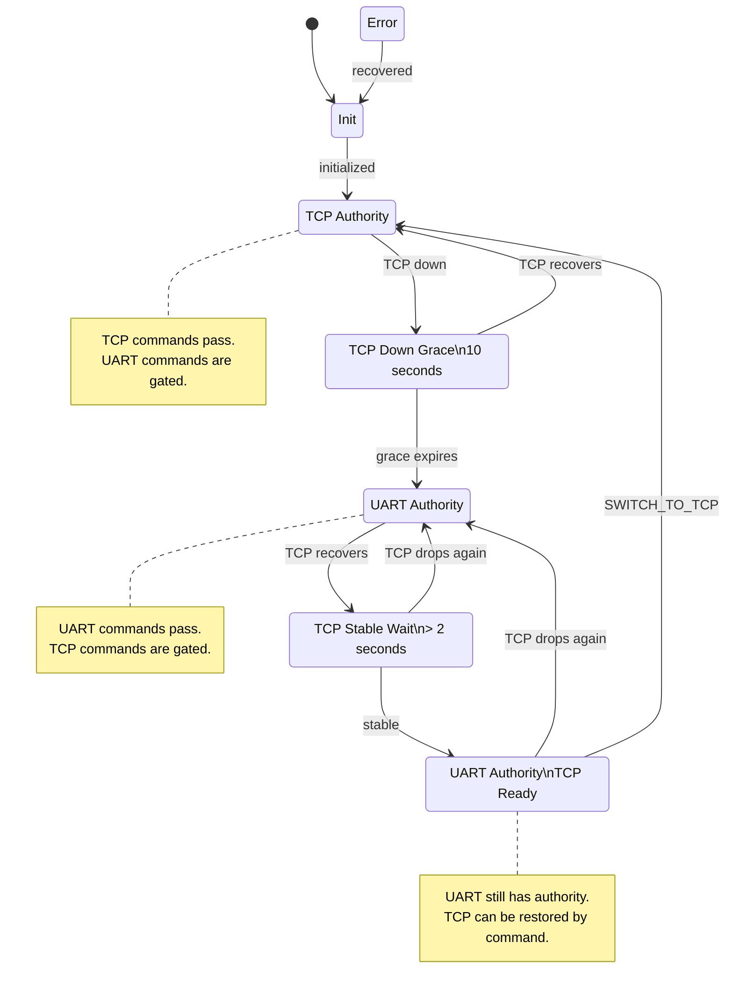

# GdsCmdAuthMux

`GdsCmdAuthMux` gates command buffers from the TCP and UART GDS paths so only one path has command authority at a time.

Default authority is TCP. If TCP is lost, TCP keeps authority for a 10-second grace period. If TCP is still down after that grace period, authority switches to UART. When TCP later recovers, the component waits until TCP has been stable for more than 2 seconds before allowing an operator command to switch authority back to TCP.

## State Machine



## Command Flow

The mux sits between the TCP/UART command routers and the existing command splitter:

```text
TCP GDS command path:
  ComFprime.fprimeRouter.commandOut
    -> imx_gdsCmdAuthMux.tcpCmdIn

UART GDS command path:
  imx_uartGdsRouter.commandOut
    -> imx_gdsCmdAuthMux.uartCmdIn

Authorized command path:
  imx_gdsCmdAuthMux.cmdOut
    -> imx_cmdSplitter.CmdBuff[0]
```

Responses flow back through the mux:

```text
imx_cmdSplitter.forwardSeqCmdStatus[0]
  -> imx_gdsCmdAuthMux.cmdResponseIn
  -> tcpCmdResponseOut or uartCmdResponseOut
```

The component tracks forwarded commands in a fixed-size table so downstream command responses return to the source that submitted the command.

## Authority Rules

When TCP has authority:

- TCP commands are forwarded to `cmdOut`.
- UART commands are rejected with `Fw::CmdResponse::BUSY`.
- `CommandRejectedInactiveAuthority("UART")` is emitted for rejected UART commands.

When UART has authority:

- UART commands are forwarded to `cmdOut`.
- TCP commands are rejected with `Fw::CmdResponse::BUSY`, except for `SWITCH_TO_TCP` after TCP becomes stable.
- `CommandRejectedInactiveAuthority("TCP")` is emitted for rejected TCP commands.

When TCP is stable but UART still has authority:

- UART continues to be the normal command source.
- TCP is allowed to send only `SWITCH_TO_TCP`; all other TCP commands remain gated.
- The operator may send `SWITCH_TO_TCP` from either GDS path.

## TCP Status Polling

The mux does not directly own the TCP driver. Instead, the i.MX topology configures a deployment-provided polling hook:

```cpp
bool pollDirectGdsTcpOpen() {
    return imx_comDriver.isOpened();
}

imx_gdsCmdAuthMux.configureTcpStatusPoller(pollDirectGdsTcpOpen);
```

On every `run` tick, `GdsCmdAuthMux` calls this poller and converts the result into state machine signals:

- `true` -> `tcp_gds_up`
- `false` -> `tcp_gds_down`

This avoids adding a separate status-splitter component and uses the actual TCP socket state tracked by `Drv::TcpServer`.

## Events

| Event | Meaning |
|---|---|
| `CommandAuthoritySwitchedToUart` | TCP stayed down through the 10-second grace period and authority moved to UART. |
| `TcpGdsRecovered` | TCP recovered while UART had authority. |
| `TcpGdsStable` | TCP stayed recovered for more than 2 seconds and may be selected by command. |
| `CommandAuthoritySwitchedToTcp` | Operator command restored TCP authority. |
| `CommandRejectedInactiveAuthority` | A command arrived from the non-authoritative GDS path. |
| `TcpRecoveredDuringGrace` | TCP recovered before the 10-second grace period expired. |

## Telemetry

| Channel | Meaning |
|---|---|
| `CommandAuthority` | `TCP` or `UART`. The serialized values remain `0` and `1`. |
| `TcpReadyForAuthority` | `ON` once TCP is stable enough for `SWITCH_TO_TCP`. |
| `TcpCommandsRejected` | Count of gated TCP commands. |
| `UartCommandsRejected` | Count of gated UART commands. |

## Operator Return to TCP

The `SWITCH_TO_TCP` command succeeds only when:

- UART currently has command authority.
- TCP has recovered.
- TCP has remained stable for more than 2 seconds.

If those conditions are not true, `SWITCH_TO_TCP` returns `Fw::CmdResponse::VALIDATION_ERROR`.
