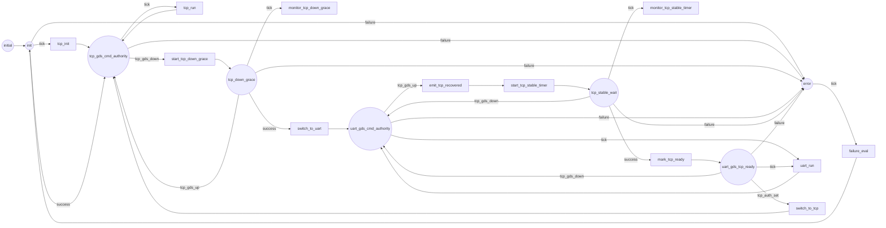
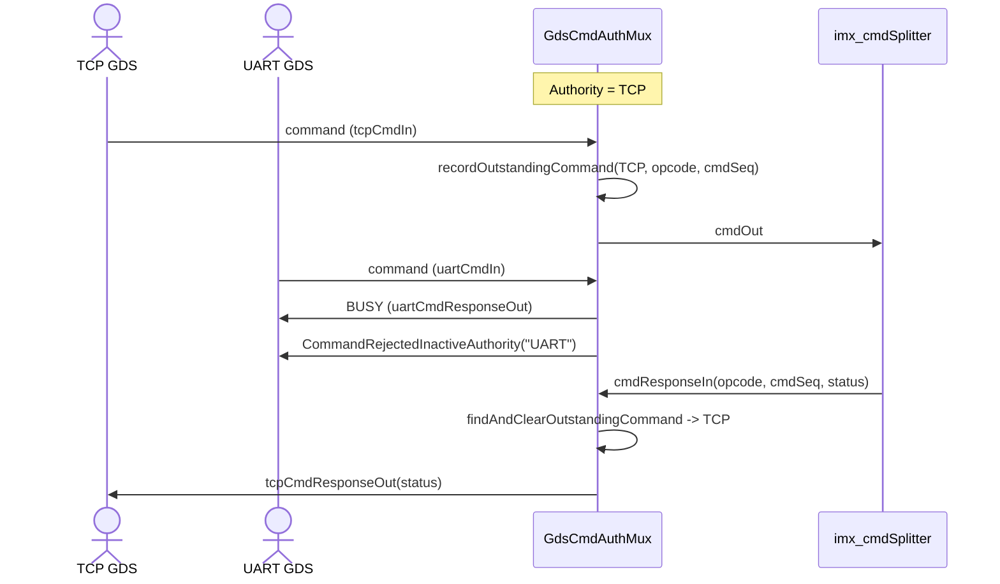
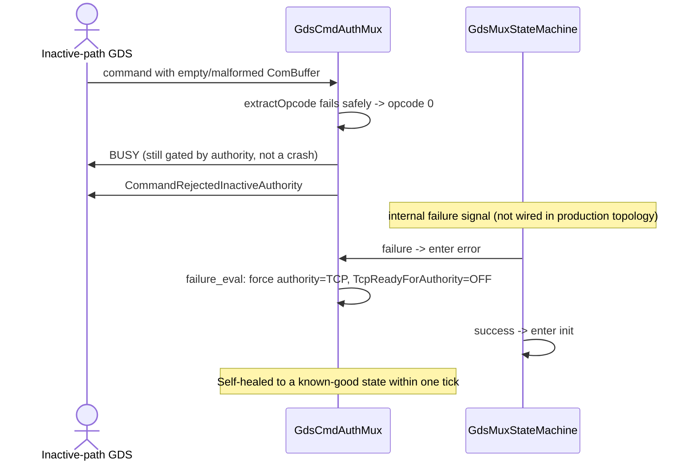

# scalesSvc::GdsCmdAuthMux

Command-authority arbiter between the TCP and UART GDS uplinks. Exactly one
path has command authority at a time; the inactive path's commands are
rejected rather than forwarded. TCP has authority by default, fails over to
UART if TCP stays down through a grace period, and only returns to TCP when
an operator explicitly commands it after TCP has proven stable.

This document records the implemented component design, interfaces, state
transitions, and verification status. See also `docs/README.md` in this
directory for a narrower, narrative-only version of the state machine and
authority rules.

## Design Summary

`GdsCmdAuthMux` sits between the two GDS command entry points (`ComFprime`'s
TCP router and the UART GDS router) and the single downstream
`imx_cmdSplitter`. It does not own the TCP transport itself; the deployment
configures a polling hook (`configureTcpStatusPoller`) that the mux calls on
every `run` tick to sample TCP liveness, avoiding a separate status-splitter
component:

```cpp
bool pollDirectGdsTcpOpen() {
    return imx_comDriver.isOpened();
}
imx_gdsCmdAuthMux.configureTcpStatusPoller(pollDirectGdsTcpOpen);
```

The poller's boolean result is converted into `tcp_gds_up`/`tcp_gds_down`
state-machine signals inside `run_handler`. The very first sample is used
only to initialize `m_tcpConnected` without generating an edge, so a
deployment that boots with TCP already down does not skip the down-grace
transition.

Command source is tracked per-`(opcode, cmdSeq)` in a fixed 16-entry table
(`m_outstandingCommands`) so `cmdResponseIn` can route each response back to
whichever GDS path actually sent that command, independent of which path
currently holds authority. If the table fills, the oldest entry (slot 0) is
overwritten rather than growing; in practice this is not expected to bind
given the small number of commands in flight at once, but it is a real
limitation worth knowing about if the outstanding-command count could ever
grow unexpectedly (e.g. GDS command storms).

A command from the currently-inactive path is rejected locally with
`Fw::CmdResponse::BUSY`, increments that path's rejected-command counter, and
emits `CommandRejectedInactiveAuthority`. One exception: while UART holds
authority and TCP has proven stable (`TcpReadyForAuthority` telemetry is ON),
TCP is allowed through for exactly one opcode -- `SWITCH_TO_TCP`'s own opcode
(`getIdBase()`) -- so the operator can issue the recovery command over
whichever GDS link is convenient; every other TCP command remains gated
until authority has actually switched back.

`SWITCH_TO_TCP` only succeeds (`OK`) when UART currently has authority *and*
TCP is ready for a commanded return; otherwise it returns
`VALIDATION_ERROR`. There is no equivalent `SWITCH_TO_UART` command --
failover to UART is automatic (see the down-grace state below) and is never
operator-initiated.

An internal `failure` signal (not currently wired from anywhere in the
production topology, but available to the state machine and exercised by
unit test) drives the mux into a transient `error` state that immediately
self-heals: `failure_eval` unconditionally forces authority back to TCP,
clears `TcpReadyForAuthority`, and signals `success`, returning to `init` on
the same tick. No event is emitted for entering or leaving `error`; this is
intentionally a silent recovery path rather than an operator-visible fault.

## Functional Diagrams

### State Machine

This is a 1:1 rendering of `GdsMuxStateMachine.fpp`. Rounded nodes are
states, rectangular nodes are FPP actions, and labels on the arrows are FPP
signals.



### Component Relationships

```mermaid
flowchart TB
    subgraph GDS["GDS command sources"]
        TCP["ComFprime.fprimeRouter (TCP GDS)"]
        UART["imx_uartGdsRouter (UART GDS)"]
        DRV["imx_comDriver (Drv.TcpServer)"]
    end

    subgraph Mux["GdsCmdAuthMux"]
        M["GdsCmdAuthMux"]
        SM["GdsMuxStateMachine"]
    end

    subgraph Downstream["Command dispatch"]
        SPLIT["imx_cmdSplitter"]
        LOCAL["CdhCore.cmdDisp"]
        REMOTE["imx_fpManager (remote Jetson path)"]
    end

    RG["imx_rateGroup2"] -->|"run tick"| M
    DRV -.->|"configureTcpStatusPoller: isOpened()"| M

    TCP -->|"tcpCmdIn"| M
    M -->|"tcpCmdResponseOut"| TCP
    UART -->|"uartCmdIn"| M
    M -->|"uartCmdResponseOut"| UART

    M &lt;-->|"signals and actions"| SM

    M -->|"cmdOut (authorized commands only)"| SPLIT
    SPLIT -->|"forwardSeqCmdStatus[0]"| M
    SPLIT --> LOCAL
    SPLIT --> REMOTE
```

### TCP Down, UART Failover, and Recovery

```mermaid
sequenceDiagram
    actor Operator as GDS Operator
    participant Poll as imx_comDriver poller
    participant M as GdsCmdAuthMux
    participant SM as GdsMuxStateMachine
    participant Split as imx_cmdSplitter

    Note over M: Authority = TCP (default)
    Poll->>M: run tick: isOpened() = false
    M->>SM: tcp_gds_down
    SM->>M: start_tcp_down_grace (record start time)

    loop every tick, grace still active
        Poll->>M: run tick: isOpened() = false
        SM->>M: monitor_tcp_down_grace (elapsed < 10s)
        Note over M: Authority remains TCP; TCP commands still forwarded
    end

    alt TCP recovers before grace expires
        Poll->>M: run tick: isOpened() = true
        M->>SM: tcp_gds_up
        M->>Operator: TcpRecoveredDuringGrace event
        Note over M: Authority remains TCP
    else grace expires (>= 10s) with TCP still down
        SM->>M: switch_to_uart
        M->>Operator: CommandAuthoritySwitchedToUart event
        Note over M: Authority = UART; TCP commands now rejected BUSY
    end

    Poll->>M: run tick: isOpened() = true (TCP recovered under UART authority)
    M->>SM: tcp_gds_up
    SM->>M: emit_tcp_recovered, start_tcp_stable_timer
    M->>Operator: TcpGdsRecovered event

    loop every tick, stability timer active
        Poll->>M: run tick: isOpened() = true
        SM->>M: monitor_tcp_stable_timer (elapsed <= 2s)
    end

    SM->>M: mark_tcp_ready (elapsed > 2s)
    M->>Operator: TcpGdsStable event, TcpReadyForAuthority=ON
    Note over M: UART still has authority; only SWITCH_TO_TCP is accepted from TCP

    Operator->>M: SWITCH_TO_TCP (via TCP or UART)
    M->>SM: tcp_auth_set
    SM->>M: switch_to_tcp
    M->>Operator: CommandAuthoritySwitchedToTcp event, CmdResponse OK
    Note over M: Authority = TCP again; UART commands now rejected BUSY
```

### Command Gating and Response Routing



### Malformed Command and Failure Recovery



### Operating Rules

1. TCP has command authority at startup by default.
2. If TCP goes down while it has authority, TCP keeps authority for a
   10-second grace period (`TCP_DOWN_GRACE_SECONDS`). If TCP recovers within
   the grace period, authority never leaves TCP and `TcpRecoveredDuringGrace`
   is emitted.
3. If TCP remains down for the full grace period, authority switches to
   UART and `CommandAuthoritySwitchedToUart` is emitted. From this point,
   TCP commands are rejected with `BUSY` until authority switches back.
4. While UART has authority, if TCP reconnects, `TcpGdsRecovered` is emitted
   and a 2-second stability timer (`TCP_STABLE_SECONDS`) starts. If TCP
   drops again before the timer elapses, the mux returns to plain UART
   authority and the timer is abandoned.
5. Once TCP has remained connected for more than the stability window,
   `TcpGdsStable` is emitted and `TcpReadyForAuthority` telemetry goes ON.
   UART still holds authority; only the `SWITCH_TO_TCP` command itself is
   now accepted from TCP, and only that opcode.
6. `SWITCH_TO_TCP` succeeds only when UART currently has authority and TCP
   is ready for a commanded return; it switches authority to TCP and emits
   `CommandAuthoritySwitchedToTcp`. Otherwise it returns
   `VALIDATION_ERROR` and authority is unchanged.
7. A command received from the path that does not currently have authority
   (with the single `SWITCH_TO_TCP`-during-ready exception above) is
   rejected locally with `BUSY`, increments that path's rejected-command
   counter, and emits `CommandRejectedInactiveAuthority`. It is never
   forwarded downstream.
8. Every forwarded command is recorded by `(opcode, cmdSeq)` so its eventual
   response is routed back to the GDS path that actually sent it, even if
   authority has changed by the time the response arrives.
9. An internal `failure` signal forces authority back to TCP and clears
   `TcpReadyForAuthority`, then immediately returns to `init` -- the mux
   never remains wedged in an unrecoverable state.

## Implementation Progress

- [x] Define `init`, TCP-authority, TCP-down-grace, UART-authority,
  TCP-stable-wait, UART-with-TCP-ready, and transient `error` states.
- [x] Default to TCP authority at startup; treat the first TCP status sample
  as initialization only, not an edge.
- [x] Implement the TCP-down grace period and automatic failover to UART.
- [x] Implement TCP-recovery detection, the stability timer, and
  `TcpReadyForAuthority` gating of the manual return path.
- [x] Implement `SWITCH_TO_TCP` with the correct authority/readiness
  preconditions.
- [x] Gate commands by current authority; reject the inactive path with
  `BUSY` and a source-labeled event; track per-path rejection counters.
- [x] Track outstanding commands by `(opcode, cmdSeq)` so responses route
  back to the actual sending path regardless of subsequent authority
  changes.
- [x] Wire TCP liveness via a deployment-supplied polling hook
  (`configureTcpStatusPoller`) instead of a dedicated status-splitter
  component.
- [x] Add the `failure` self-healing path back to a known-good state.
- [x] Add unit tests for startup authority, grace-period expiry and
  in-grace recovery, command gating/response routing, the full recovery and
  manual-return sequence, and malformed-command/failure-signal handling.

## Component Relationships

The deployment topology wires both GDS command entry points into the mux and
its single authorized output into the existing command splitter; the mux
does not talk to `imx_cmdSplitter`'s local/remote fan-out logic directly.
`imx_comDriver`'s open/closed state is the sole TCP-liveness signal, sampled
via a polling hook rather than a port connection. The authoritative wiring
is in `ImxDeployment/Top/topology.fpp` (`ComFprime_CdhCore`, `UartGdsUplink`,
`RateGroups`, and `hub` connection blocks) and `ImxDeploymentTopology.cpp`
(`configureTcpStatusPoller`).

## Port Descriptions
| Name | Description |
|---|---|
| `tcpCmdIn` / `uartCmdIn` | Command buffers from the TCP and UART GDS routers, respectively. |
| `cmdOut` | The single authorized command output, forwarded to `imx_cmdSplitter`. |
| `cmdResponseIn` | Command status returned from downstream dispatch; routed back by recorded source. |
| `tcpCmdResponseOut` / `uartCmdResponseOut` | Command status delivered back to whichever GDS path actually sent the command (or was rejected locally). |
| `tcpGdsStatus` | TCP connection-state sample, driven internally from `run_handler` via the configured poller -- not connected in the topology. |
| `run` | Rate-group tick; drives the state-machine `tick` signal, polls TCP status, and republishes telemetry. |

## Component States
| Name | Description |
|---|---|
| `init` | Startup state; establishes TCP authority and, if TCP is already down, immediately begins the down-grace period. |
| `tcp_gds_cmd_authority` | TCP has authority; TCP commands pass, UART commands are gated. |
| `tcp_down_grace` | TCP is down but still within the 10-second grace window; authority has not yet moved. |
| `uart_gds_cmd_authority` | UART has authority; UART commands pass, TCP commands are gated. |
| `tcp_stable_wait` | TCP has reconnected while UART has authority; waiting out the 2-second stability timer. |
| `uart_gds_tcp_ready` | UART still has authority; TCP has proven stable and may be restored only via `SWITCH_TO_TCP`. |
| `error` | Transient; immediately forces authority back to TCP and returns to `init` on the next tick. |

## Parameters
| Name | Description |
|---|---|
| None | `GdsCmdAuthMux` has no configurable parameters. The 10-second down-grace and 2-second stability windows are compile-time constants (`TCP_DOWN_GRACE_SECONDS`, `TCP_STABLE_SECONDS`) in `GdsCmdAuthMux.cpp`. |

## Commands
| Name | Description |
|---|---|
| `SWITCH_TO_TCP` | Requests a return to TCP command authority. Succeeds only when UART has authority and TCP is ready for a commanded return; otherwise returns `VALIDATION_ERROR`. |

## Events
| Name | Description |
|---|---|
| `CommandAuthoritySwitchedToUart` | TCP stayed down through the full grace period; authority moved to UART. |
| `TcpGdsRecovered` | TCP reconnected while UART had authority; the stability timer has started. |
| `TcpGdsStable` | TCP remained connected past the stability window; eligible for `SWITCH_TO_TCP`. |
| `CommandAuthoritySwitchedToTcp` | `SWITCH_TO_TCP` succeeded; authority returned to TCP. |
| `CommandRejectedInactiveAuthority` | A command arrived from the GDS path that does not currently have authority. |
| `TcpRecoveredDuringGrace` | TCP reconnected before the down-grace period expired; authority never left TCP. |

## Telemetry
| Name | Description |
|---|---|
| `CommandAuthority` | Current authority (`TCP` or `UART`). |
| `TcpReadyForAuthority` | `ON` once TCP has passed the stability window and `SWITCH_TO_TCP` will be accepted. |
| `TcpCommandsRejected` | Running count of TCP commands rejected for lacking authority. |
| `UartCommandsRejected` | Running count of UART commands rejected for lacking authority. |

## Unit Tests
| Name | Description | Output | Coverage |
|---|---|---|---|
| `StartupWithTcpUp` | Verifies default startup behavior with TCP already connected. | Authority `TCP`, `TcpReadyForAuthority` OFF, no switch events | GCA-001 |
| `StartupWithTcpDownAndGracePeriod` | TCP down from t=0; checks authority at t=9s (unchanged) and t=10s (switched). | Authority stays `TCP` through t=9s; switches to `UART` with `CommandAuthoritySwitchedToUart` at the grace boundary | GCA-002 |
| `TcpRecoveryDuringGracePeriod` | TCP down, then recovers at t=5s, inside the 10s grace window. | `TcpRecoveredDuringGrace` emitted; authority stays `TCP`; no switch-to-UART event | GCA-003 |
| `CommandGatingAndResponseRouting` | Sends TCP and UART commands under both authority states and verifies response routing. | Correct forward/reject per authority; responses routed to the original sender; rejection counters correct | GCA-004, GCA-005 |
| `RecoveryAndManualReturnToTcp` | Full grace-expiry -> UART authority -> TCP recovers -> stability wait -> `TcpGdsStable` -> gated `SWITCH_TO_TCP`-only window -> operator switches back. | Correct event sequence; only `SWITCH_TO_TCP` accepted from TCP during the ready window; `CommandAuthoritySwitchedToTcp` and `CmdResponse::OK` on success | GCA-006, GCA-007, GCA-008 |
| `MalformedCommandsAndFailureRecovery` | Sends an empty/malformed `ComBuffer` from the inactive path; drives the `failure` signal directly. | Malformed command still rejected with `BUSY`; `failure` restores `TCP` authority and `TcpReadyForAuthority` OFF; a subsequent TCP up/down/up/down sequence never marks TCP ready outside the full stable window | GCA-009, GCA-010 |

## Requirements
| Name | Description | Validation |
|---|---|---|
| GCA-001 | TCP GDS shall have command authority by default at startup. | `StartupWithTcpUp` |
| GCA-002 | If TCP GDS remains down for at least the down-grace interval, command authority shall switch to UART GDS. | `StartupWithTcpDownAndGracePeriod` |
| GCA-003 | If TCP GDS recovers within the down-grace interval, authority shall remain TCP and no switch-to-UART shall occur. | `TcpRecoveryDuringGracePeriod` |
| GCA-004 | A command received from the GDS path that does not currently hold authority shall be rejected with `BUSY` and shall increment that path's rejected-command counter. | `CommandGatingAndResponseRouting` |
| GCA-005 | Command responses shall be routed back to the GDS path that originally sent the command, tracked per `(opcode, cmdSeq)`, regardless of which path currently holds authority. | `CommandGatingAndResponseRouting` |
| GCA-006 | While UART holds authority, if TCP recovers and remains connected for at least the stability interval, TCP shall become eligible for a manual return but shall not automatically regain authority. | `RecoveryAndManualReturnToTcp` |
| GCA-007 | While TCP is eligible for manual return, only the `SWITCH_TO_TCP` command shall be accepted from TCP; all other TCP commands remain rejected until authority actually switches. | `RecoveryAndManualReturnToTcp` |
| GCA-008 | `SWITCH_TO_TCP` shall switch authority back to TCP only when TCP is ready for a commanded return; otherwise it shall return `VALIDATION_ERROR` and leave authority unchanged. | `RecoveryAndManualReturnToTcp` |
| GCA-009 | Malformed command buffers shall still be gated by current authority rather than bypassing rejection or crashing. | `MalformedCommandsAndFailureRecovery` |
| GCA-010 | An internal failure signal shall force the mux back to a known-good state (TCP authority, `TcpReadyForAuthority` OFF) rather than remaining wedged in an error state. | `MalformedCommandsAndFailureRecovery` |

## Change Log
| Date | Description |
|---|---|
| 2026-07-27 | Replaced the requirements-template stub with the full implemented design: state machine, topology wiring, operating rules, events/telemetry, and the requirements/unit-test mapping for the six existing `GdsCmdAuthMuxTester` cases. No functional changes; this is a documentation-only pass. |
