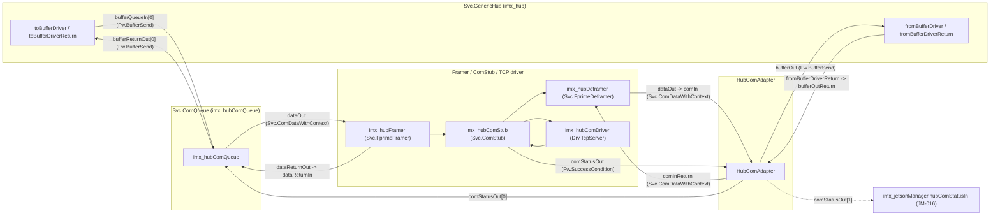
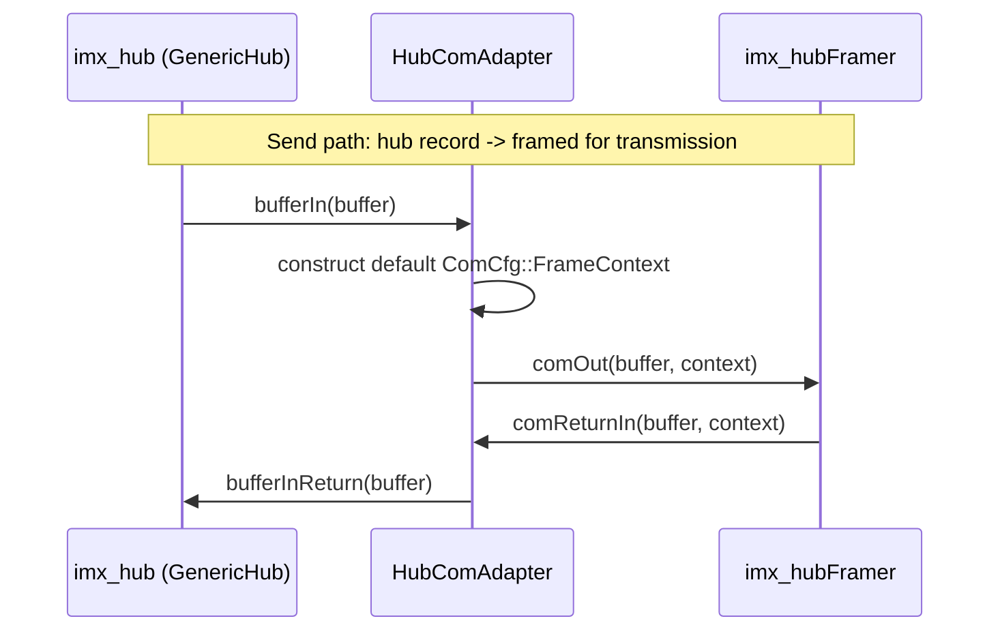
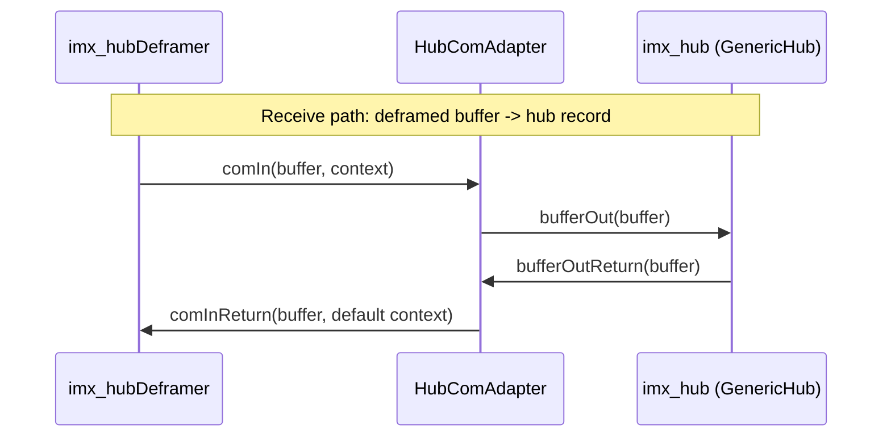
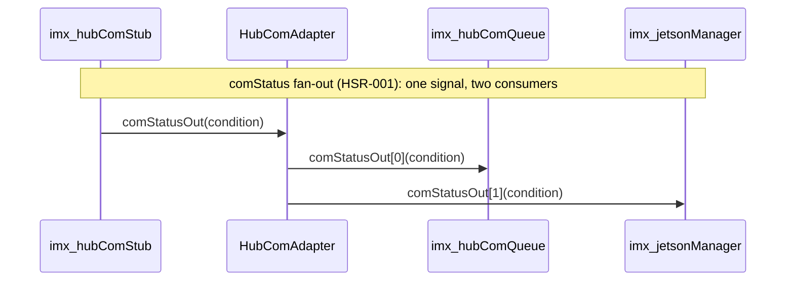

# scalesSvc::HubComAdapter

Stateless protocol adapter between `Svc.GenericHub` and the F Prime
framer/deframer/`Svc.ComStub` stack. It exists purely to bridge two
incompatible port families so GenericHub -- which only knows about plain
buffers -- can be framed, transmitted, received, and deframed by the
standard F Prime communications stack.

This document records the implemented component design, interfaces, and
verification status.

## Design Summary

`Svc.GenericHub` exchanges plain `Fw::Buffer` values over the `Fw.BufferSend`
port family (`toBufferDriver`/`toBufferDriverReturn` on the send side,
`fromBufferDriver`/`fromBufferDriverReturn` on the receive side). The F
Prime framer/deframer stack (`Svc.FprimeFramer`, `Svc.FprimeDeframer`)
instead exchanges `Svc.ComDataWithContext`, i.e. a buffer paired with a
`ComCfg::FrameContext` the framer/deframer needs. GenericHub has no concept
of that context. `HubComAdapter` is the shim in between: on the send side it
manufactures a default-constructed `ComCfg::FrameContext` when handing a hub
buffer to the framer; on the receive side it discards the `FrameContext`
when handing a deframed buffer back to the hub.

The component is `passive` and holds no state between calls: every handler
is a direct, single-line pass-through (see `HubComAdapter.cpp`). It defines
no commands, events, telemetry, or parameters, and (unlike most F Prime
components) has no standard AC ports at all (no `time get`, `command
recv`/`reg`/`resp`, `event`, `telemetry`, or `param` ports) -- there is
nothing here that needs the framework's logging/command/parameter
infrastructure, and no boilerplate is included for machinery this component
never uses.

The `comIn` port (receive direction, hub-bound) is `guarded` rather than
`sync`; the other three handlers are `sync`. This suggests `comIn` may be
invoked from a different calling context/thread than the send-path ports,
and the framework-provided mutex guard protects the (stateless) handler from
concurrent reentry. No shared state actually needs protecting today since
each handler only touches its own local `FrameContext` and immediately
forwards -- but the guard is cheap and matches the safer default for a
receive path whose caller isn't guaranteed to be the same thread as the
send path's callers.

A fifth pair, `comStatusIn`/`comStatusOut[2]` (HSR-001), is unrelated to the
buffer-bridging role above -- it exists purely because `Svc::ComStub`'s
`comStatusOut` (real transport-level connection status) is a single-
connection port, but two independent consumers need to see it: the
hub-link `Svc::ComQueue` (needs it to actually gate sends -- see
`ImxDeployment/Top/topology.fpp`'s `send_hub` connections) and
`JetsonManager` (needs it directly for its own fast, informative rejection
-- JM-016 in `JetsonManager`'s SDD). `HubComAdapter` was already the
minimal, stateless, topologically-adjacent pass-through component sitting
in exactly this part of the pipeline, so this fan-out was added here
rather than as a new single-purpose component. `comStatusIn_handler`
forwards to every connected index of `comStatusOut` unconditionally
(currently both are always connected).

## Functional Diagrams

### Component Relationships

### Send and Receive Sequences

## Operating Rules

1. Every buffer handed to `bufferIn` is forwarded to `comOut` unchanged,
   paired with a freshly default-constructed `ComCfg::FrameContext` (the
   adapter does not populate or interpret context fields).
2. Every buffer returned via `comReturnIn` is forwarded to `bufferInReturn`
   unchanged; the `FrameContext` on the return path is not used.
3. Every buffer delivered via `comIn` is forwarded to `bufferOut` unchanged;
   the incoming `FrameContext` is not used.
4. Every buffer returned via `bufferOutReturn` is forwarded to
   `comInReturn` unchanged, paired with a freshly default-constructed
   `ComCfg::FrameContext`.
5. No buffer is copied, inspected, queued, or dropped. The adapter performs
   no error handling of its own; a malformed or zero-length buffer is passed
   through exactly as received; correctness of the buffer's contents is the
   responsibility of `GenericHub` and the framer/deframer stack.
6. Every `comStatusIn` condition is forwarded, unmodified, to every
   currently-connected index of `comStatusOut` -- not just the first. No
   condition is cached, inspected, or dropped; a disconnected index is
   simply skipped (`isConnected_comStatusOut_OutputPort`).

## Implementation Progress

- [x] Define the four pass-through handlers (`bufferIn`, `comReturnIn`,
  `comIn`, `bufferOutReturn`) bridging `Fw.BufferSend` and
  `Svc.ComDataWithContext`.
- [x] Wire both directions into the i.MX hub topology (`send_hub` and
  `recv_hub` connection blocks in `ImxDeployment/Top/topology.fpp`).
- [x] Added `HubComAdapterTester` with one test per handler, asserting each
  forwards its argument(s) unchanged to the corresponding output port
  exactly once, and that the manufactured `FrameContext` on the two
  send-side handlers is the struct's default value.

## Component Relationships

The deployment topology wires `HubComAdapter` symmetrically into both
directions of the i.MX hub's communications stack: `imx_hub` on one side
(`Fw.BufferSend`), and `imx_hubFramer`/`imx_hubDeframer` (which in turn talk
to `imx_hubComStub` and `imx_hubComDriver`) on the other
(`Svc.ComDataWithContext`). The authoritative wiring is in
`ImxDeployment/Top/topology.fpp`'s `send_hub` and `recv_hub` connection
blocks; the instance itself (`imx_hubComAdapter`) is declared in
`ImxDeployment/Top/instances.fpp`.

## Port Descriptions
| Name | Description |
|---|---|
| `bufferIn` | Buffer from `GenericHub` to be framed and transmitted. |
| `bufferInReturn` | Returns ownership of a `bufferIn` buffer once the framer stack is done with it. |
| `comOut` | Forwards a hub buffer (with a default `FrameContext`) into the framer. |
| `comReturnIn` | Receives a buffer back from the framer once it has been consumed. |
| `comIn` | Receives a deframed buffer (with `FrameContext`) from the communications stack. Guarded, not sync. |
| `comInReturn` | Returns a consumed deframed buffer (with a default `FrameContext`) to the deframer. |
| `bufferOut` | Forwards a deframed buffer into `GenericHub`. |
| `bufferOutReturn` | Receives a consumed buffer back from `GenericHub`. |
| `comStatusIn` | Real hub-link transport status from `imx_hubComStub.comStatusOut`. Unrelated to the buffer-bridging ports above -- see Design Summary. |
| `comStatusOut` | `[2]`-sized fan-out of `comStatusIn`: index 0 to `imx_hubComQueue`, index 1 to `imx_jetsonManager` (JM-016). |

## Component States
| Name | Description |
|---|---|
| None | `HubComAdapter` is stateless; it holds no member state and has no internal modes. |

## Parameters
| Name | Description |
|---|---|
| None | `HubComAdapter` has no configurable parameters. |

## Commands
| Name | Description |
|---|---|
| None | `HubComAdapter` has no commands (no `command recv` port). |

## Events
| Name | Description |
|---|---|
| None | `HubComAdapter` has no events (no `event` port). |

## Telemetry
| Name | Description |
|---|---|
| None | `HubComAdapter` has no telemetry (no `telemetry` port). |

## Unit Tests

Measured via `fprime-util check --coverage`: **100% line (21/21), 100%
function (7/7), 58.3% branch (7/12)**. The uncovered branches are ASan/UBSan
instrumentation edges around construction (the same non-actionable pattern
documented throughout this audit), unsurprising for a component this small.
Each test is tagged with `RecordProperty("requirement", "<REQ-ID>")`, so
running the test binary with `--gtest_output=xml:<path>` produces a
JUnit-style XML report whose `<testcase>` elements carry that mapping as a
machine-checkable artifact.

| Name | Description | Verifies |
|---|---|---|
| `BufferInForwardsToComOutWithDefaultContext` | Invokes `bufferIn` with a buffer and confirms `comOut` receives the same data pointer/size paired with a default-constructed `FrameContext`. | HCA-001 |
| `ComReturnInForwardsToBufferInReturn` | Invokes `comReturnIn` and confirms `bufferInReturn` receives the same buffer. | HCA-002 |
| `ComInForwardsToBufferOut` | Invokes `comIn` and confirms `bufferOut` receives the same buffer. | HCA-003 |
| `BufferOutReturnForwardsToComInReturnWithDefaultContext` | Invokes `bufferOutReturn` and confirms `comInReturn` receives the same buffer paired with a default-constructed `FrameContext`. | HCA-004 |
| `ComStatusInFansOutToAllConnectedIndices` | Invokes `comStatusIn` with `SUCCESS` and confirms `comStatusOut` fires exactly twice (once per connected index), both carrying `SUCCESS`. | HSR-001 |

## Requirements
| Name | Description | Verified By |
|---|---|---|
| HCA-001 | A buffer received on `bufferIn` shall be forwarded to `comOut` unchanged, paired with a default `FrameContext`. | `BufferInForwardsToComOutWithDefaultContext` |
| HCA-002 | A buffer received on `comReturnIn` shall be forwarded to `bufferInReturn` unchanged. | `ComReturnInForwardsToBufferInReturn` |
| HCA-003 | A buffer received on `comIn` shall be forwarded to `bufferOut` unchanged. | `ComInForwardsToBufferOut` |
| HCA-004 | A buffer received on `bufferOutReturn` shall be forwarded to `comInReturn` unchanged, paired with a default `FrameContext`. | `BufferOutReturnForwardsToComInReturnWithDefaultContext` |
| HSR-001 | A condition received on `comStatusIn` shall be forwarded, unmodified, to every currently-connected index of `comStatusOut`. | `ComStatusInFansOutToAllConnectedIndices` |

## Change Log
| Date | Description |
|---|---|
| 2026-07-27 | Initial SDD documenting the implemented pass-through adapter, its topology wiring, and the current absence of unit test coverage. No functional changes; this is a documentation-only pass. |
| 2026-07-28 | Added `HubComAdapterTester` (`test/ut/`) with one test per handler and wired `register_fprime_ut` into `CMakeLists.txt` -- this component had no test target at all before. Measured 100% line, 100% function, 50.0% branch coverage. Tagged every test with `RecordProperty("requirement", ...)` and added `Verified By`/`Verifies` traceability to the Requirements/Unit Tests tables. | Luca Lanzillotta |
| 2026-07-31 | **Added `comStatusIn`/`comStatusOut[2]` fan-out (HSR-001)**: as part of adding a `Svc::ComQueue` safety net under the imx<->Jetson hub link (see JetsonManager's SDD, JM-016), two independent consumers needed `imx_hubComStub.comStatusOut` -- the new `imx_hubComQueue` (to actually gate sends) and `imx_jetsonManager` (already reading it directly for its own fast rejection path). F Prime ports are strictly 1:1, so something had to split the signal. Considered a new single-purpose component first; rejected it as unnecessary overhead (new directory, build target, base ID, SDD) for ~3 lines of logic when `HubComAdapter` was already the minimal, stateless, topologically-adjacent pass-through component sitting in exactly this part of the pipeline -- added the fan-out here instead. Unrelated to this component's existing buffer-bridging role (see Design Summary), but a natural fit for "small, stateless, sits in the hub pipeline." `imx_hubComAdapter`'s send-side buffer-bridging ports (`bufferIn`/`comOut`/`comReturnIn`) are retired as part of the same change -- `imx_hubComQueue` now performs that bridging on the send side, using the identical default-`FrameContext` construction; the receive-side role (`comIn`/`bufferOut`/etc.) is unchanged. Added `ComStatusInFansOutToAllConnectedIndices`. Coverage: 100% line / 100% function / 58.3% branch. | Luca Lanzillotta |
