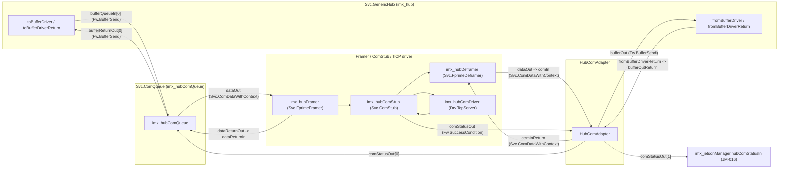
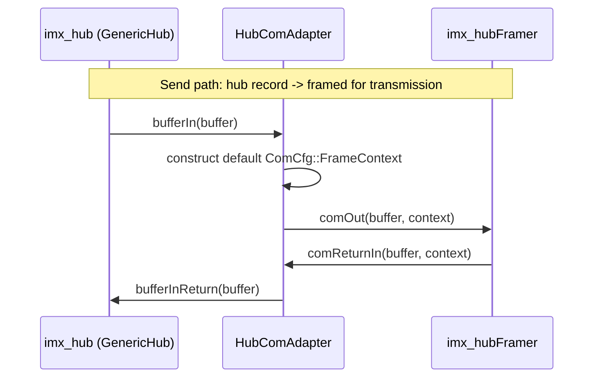
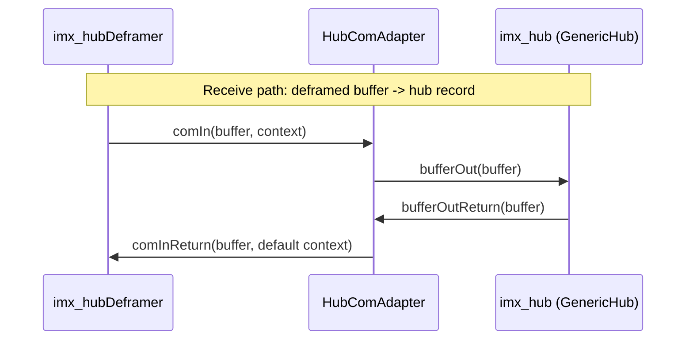
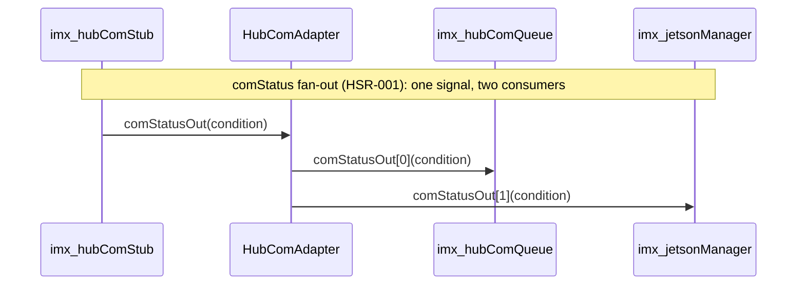

# scalesSvc::HubComAdapter

Stateless protocol adapter between `Svc.GenericHub` and the F Prime
framer/deframer/`Svc.ComStub` stack. It exists purely to bridge two
incompatible port families so GenericHub -- which only knows about plain
buffers -- can be framed, transmitted, received, and deframed by the
standard F Prime communications stack.

This document records the implemented component design, interfaces, and
verification status.

## Design Summary

### Why this component has to exist at all

Two pieces of F Prime framework code need to talk to each other on the
imx<->Jetson hub link, and neither one was written with the other in mind.

`Svc.GenericHub` is a general-purpose multiplexer: its whole job is to take
*every* logical port a deployment routes across a link -- commands,
telemetry, events, arbitrary serialized ports -- and reduce them all down to
one dead-simple interface: "here is a buffer of bytes to send" / "here is a
buffer of bytes I received." It doesn't know or care what transport carries
those bytes -- TCP here, could be UART, could be a radio link on a different
project. Concretely, it speaks `Fw.BufferSend`: a port type that carries
nothing but a `Fw::Buffer` (a pointer + a length).

The standard F Prime send/receive pipeline (`Svc.FprimeFramer` ->
`Svc.ComStub` -> the TCP driver, and `Svc.FprimeDeframer` coming back) is a
*different* piece of reusable framework code, built to handle framing
(marking where one message ends and the next begins on a raw byte stream),
retries, and link status. It wasn't designed around GenericHub specifically
-- it's the general-purpose uplink/downlink pipeline any F Prime deployment
can plug a driver into. Its ports don't speak plain `Fw.BufferSend`; they
speak `Svc.ComDataWithContext` -- a buffer *plus* a small `ComCfg::FrameContext`
struct that lets pipeline stages attach metadata to a chunk of data as it
moves through.

F Prime enforces that a port's output type must exactly match whatever it's
wired to -- there's no automatic conversion. `Fw.BufferSend` and
`Svc.ComDataWithContext` are different types, full stop, so `GenericHub`
cannot be wired directly to the framer/ComStub stack any more than you could
plug a USB cable straight into an RCA jack: both carry "a signal," but the
connector shapes don't match. `HubComAdapter` is that adapter cable -- one
end shaped like what `GenericHub` expects, the other end shaped like what
the framer/deframer stack expects, translating between the two, every time
data crosses in either direction.

Since `HubComAdapter` sits *between* the two and has no idea what should
actually go inside a `ComCfg::FrameContext` (that's meaningful to the
framer/deframer, not to the hub), the only correct thing it can do is hand
across a blank, default-constructed one on the way toward the framer, and
throw the context away on the way back toward the hub (`GenericHub` has no
use for it either). It isn't guessing or approximating a value here -- there
genuinely is no more-correct value it could supply, since it has no
visibility into anything protocol-specific.

### Why every port has a matching "return" port

Flight software generally avoids allocating memory at runtime (`malloc`/
`free`) -- unpredictable timing and the risk of fragmentation are both bad
news for something that might run for years without a reboot. Instead,
buffers come from a fixed-size pool set up once at startup (a
`Svc::BufferManager` -- `imx_hubBufferManager`/`imx_hubIoBufferManager`
elsewhere in this deployment). If you've worked with a fixed pool of DMA
descriptors or ring-buffer slots in embedded/driver code, this is the exact
same idea: when one component hands a buffer to another, it isn't giving
that memory away -- it's lending it, the same way you'd check a numbered
tool out of a shared toolbox. Every buffer that goes out has to come back
in, or the pool eventually runs dry and nothing can be sent anymore.

That's why almost every "forward this buffer" port in the F Prime comm stack
has a matching "give it back" port running in the *opposite* direction --
and it's why `HubComAdapter`, sitting in the middle of two directions of
traffic, ends up with eight ports instead of two. It has to participate in
both halves of the borrow/return cycle, for both directions it bridges:

| Direction | Forward (lend the buffer) | Return (give it back) |
|---|---|---|
| Send (hub -> framer) | `bufferIn` (from `GenericHub`) -> `comOut` (to the framer) | `comReturnIn` (framer is done) -> `bufferInReturn` (back to `GenericHub`) |
| Receive (deframer -> hub) | `comIn` (from the deframer) -> `bufferOut` (to `GenericHub`) | `bufferOutReturn` (`GenericHub` is done) -> `comInReturn` (back to the deframer) |

Every one of those four ports exists because *something on one side of this
adapter has a port with that exact name and type, and this adapter has to
have a matching port to connect to it* -- none of them are optional or
stylistic; each is satisfying a concrete connection requirement from either
`GenericHub` or the framer/deframer stack.

### Why `comIn` is `guarded` instead of `sync`

The other three handlers are `sync`: they run immediately, inline, on
whatever thread happens to call them -- fine as long as you're sure only one
caller will ever invoke that specific port. `comIn` is fed from the
deframer, which sits on the receive side of the stack and may end up driven
from a different calling context than the send-side ports (e.g. whatever
context the TCP driver's own receive processing runs in). A `guarded` port
still runs immediately/inline like `sync` does, but the framework wraps the
call in a mutex first, so two callers arriving around the same time get
serialized instead of racing. Nothing in `HubComAdapter` actually has shared
state that could be corrupted today -- every handler only ever touches a
local variable -- so this guard isn't fixing an active bug, it's cheap
insurance on the one port where "could this get called from two places at
once" is a real, not just theoretical, question.

### Why there's no command, event, telemetry, or parameter ports

Most F Prime components carry a standard set of extra ports so they can
receive commands, log events, publish telemetry, and read/write parameters
-- even `HubComAdapter`'s close neighbors in this deployment (`JetsonManager`,
`FPManager`) have all of these. `HubComAdapter` deliberately has none of
them. That's not an oversight; it follows directly from the fact that this
component has nothing to say. It never makes a decision, never detects an
error worth reporting, never has a value worth downlinking, and never needs
an operator-tunable setting -- every handler is an unconditional, one-line
forward. Adding command/event/telemetry/parameter ports here would mean
including framework machinery this component would never actually use, just
because most components happen to need it. The requirement really is "bridge
two port types, nothing else," so the port list reflects exactly that and
nothing more.

### The `comStatus` fan-out: a second, unrelated job riding along

A fifth pair, `comStatusIn`/`comStatusOut[2]` (HSR-001), has nothing to do
with the buffer-bridging role above -- it's a completely separate problem
that happened to need a home. `Svc::ComStub`'s `comStatusOut` reports the
hub link's real, transport-level connection status (`SUCCESS` when it's up,
`FAILURE` the moment a send fails), and it's a single-connection port -- but
two independent things need to see that same signal: the hub-link
`Svc::ComQueue` (which needs it to actually decide whether to release a
buffer -- see `ImxDeployment/Top/topology.fpp`'s `send_hub` connections) and
`JetsonManager` (which needs it directly for its own fast, informative
command rejection -- JM-016 in `JetsonManager`'s SDD). F Prime ports are
strictly one-to-one, so *something* has to split that one signal into two.

A dedicated new component for just this was considered and rejected: three
lines of logic don't justify a new directory, build target, base ID, and
SDD when `HubComAdapter` was already sitting in exactly this part of the
pipeline, already minimal, already stateless. So the fan-out lives here
instead -- `comStatusIn_handler` forwards whatever it receives to every
currently-connected index of `comStatusOut` unconditionally (today, both
index 0 and index 1 are always connected).

## Functional Diagrams

### Component Relationships

### Send and Receive Sequences

## Operating Rules

1. Every buffer handed to `bufferIn` is forwarded to `comOut` unchanged,
   paired with a freshly default-constructed `ComCfg::FrameContext` (the
   adapter does not populate or interpret context fields).
2. Every buffer returned via `comReturnIn` is forwarded to `bufferInReturn`
   unchanged; the `FrameContext` on the return path is not used.
3. Every buffer delivered via `comIn` is forwarded to `bufferOut` unchanged;
   the incoming `FrameContext` is not used.
4. Every buffer returned via `bufferOutReturn` is forwarded to
   `comInReturn` unchanged, paired with a freshly default-constructed
   `ComCfg::FrameContext`.
5. No buffer is copied, inspected, queued, or dropped. The adapter performs
   no error handling of its own; a malformed or zero-length buffer is passed
   through exactly as received; correctness of the buffer's contents is the
   responsibility of `GenericHub` and the framer/deframer stack.
6. Every `comStatusIn` condition is forwarded, unmodified, to every
   currently-connected index of `comStatusOut` -- not just the first. No
   condition is cached, inspected, or dropped; a disconnected index is
   simply skipped (`isConnected_comStatusOut_OutputPort`).

## Implementation Progress

- [x] Define the four pass-through handlers (`bufferIn`, `comReturnIn`,
  `comIn`, `bufferOutReturn`) bridging `Fw.BufferSend` and
  `Svc.ComDataWithContext`.
- [x] Wire both directions into the i.MX hub topology (`send_hub` and
  `recv_hub` connection blocks in `ImxDeployment/Top/topology.fpp`).
- [x] Added `HubComAdapterTester` with one test per handler, asserting each
  forwards its argument(s) unchanged to the corresponding output port
  exactly once, and that the manufactured `FrameContext` on the two
  send-side handlers is the struct's default value.

## Component Relationships

The deployment topology wires `HubComAdapter` symmetrically into both
directions of the i.MX hub's communications stack: `imx_hub` on one side
(`Fw.BufferSend`), and `imx_hubFramer`/`imx_hubDeframer` (which in turn talk
to `imx_hubComStub` and `imx_hubComDriver`) on the other
(`Svc.ComDataWithContext`). The authoritative wiring is in
`ImxDeployment/Top/topology.fpp`'s `send_hub` and `recv_hub` connection
blocks; the instance itself (`imx_hubComAdapter`) is declared in
`ImxDeployment/Top/instances.fpp`.

## Port Descriptions
| Name | Description |
|---|---|
| `bufferIn` | Buffer from `GenericHub` to be framed and transmitted. |
| `bufferInReturn` | Returns ownership of a `bufferIn` buffer once the framer stack is done with it. |
| `comOut` | Forwards a hub buffer (with a default `FrameContext`) into the framer. |
| `comReturnIn` | Receives a buffer back from the framer once it has been consumed. |
| `comIn` | Receives a deframed buffer (with `FrameContext`) from the communications stack. Guarded, not sync. |
| `comInReturn` | Returns a consumed deframed buffer (with a default `FrameContext`) to the deframer. |
| `bufferOut` | Forwards a deframed buffer into `GenericHub`. |
| `bufferOutReturn` | Receives a consumed buffer back from `GenericHub`. |
| `comStatusIn` | Real hub-link transport status from `imx_hubComStub.comStatusOut`. Unrelated to the buffer-bridging ports above -- see Design Summary. |
| `comStatusOut` | `[2]`-sized fan-out of `comStatusIn`: index 0 to `imx_hubComQueue`, index 1 to `imx_jetsonManager` (JM-016). |

## Component States
| Name | Description |
|---|---|
| None | `HubComAdapter` is stateless; it holds no member state and has no internal modes. |

## Parameters
| Name | Description |
|---|---|
| None | `HubComAdapter` has no configurable parameters. |

## Commands
| Name | Description |
|---|---|
| None | `HubComAdapter` has no commands (no `command recv` port). |

## Events
| Name | Description |
|---|---|
| None | `HubComAdapter` has no events (no `event` port). |

## Telemetry
| Name | Description |
|---|---|
| None | `HubComAdapter` has no telemetry (no `telemetry` port). |

## Unit Tests

Measured via `fprime-util check --coverage`: **100% line (21/21), 100%
function (7/7), 58.3% branch (7/12)**. The uncovered branches are ASan/UBSan
instrumentation edges around construction (the same non-actionable pattern
documented throughout this audit), unsurprising for a component this small.
Each test is tagged with `RecordProperty("requirement", "<REQ-ID>")`, so
running the test binary with `--gtest_output=xml:<path>` produces a
JUnit-style XML report whose `<testcase>` elements carry that mapping as a
machine-checkable artifact.

| Name | Description | Verifies |
|---|---|---|
| `BufferInForwardsToComOutWithDefaultContext` | Invokes `bufferIn` with a buffer and confirms `comOut` receives the same data pointer/size paired with a default-constructed `FrameContext`. | HCA-001 |
| `ComReturnInForwardsToBufferInReturn` | Invokes `comReturnIn` and confirms `bufferInReturn` receives the same buffer. | HCA-002 |
| `ComInForwardsToBufferOut` | Invokes `comIn` and confirms `bufferOut` receives the same buffer. | HCA-003 |
| `BufferOutReturnForwardsToComInReturnWithDefaultContext` | Invokes `bufferOutReturn` and confirms `comInReturn` receives the same buffer paired with a default-constructed `FrameContext`. | HCA-004 |
| `ComStatusInFansOutToAllConnectedIndices` | Invokes `comStatusIn` with `SUCCESS` and confirms `comStatusOut` fires exactly twice (once per connected index), both carrying `SUCCESS`. | HSR-001 |

## Requirements
| Name | Description | Verified By |
|---|---|---|
| HCA-001 | A buffer received on `bufferIn` shall be forwarded to `comOut` unchanged, paired with a default `FrameContext`. | `BufferInForwardsToComOutWithDefaultContext` |
| HCA-002 | A buffer received on `comReturnIn` shall be forwarded to `bufferInReturn` unchanged. | `ComReturnInForwardsToBufferInReturn` |
| HCA-003 | A buffer received on `comIn` shall be forwarded to `bufferOut` unchanged. | `ComInForwardsToBufferOut` |
| HCA-004 | A buffer received on `bufferOutReturn` shall be forwarded to `comInReturn` unchanged, paired with a default `FrameContext`. | `BufferOutReturnForwardsToComInReturnWithDefaultContext` |
| HSR-001 | A condition received on `comStatusIn` shall be forwarded, unmodified, to every currently-connected index of `comStatusOut`. | `ComStatusInFansOutToAllConnectedIndices` |

## Change Log
| Date | Description |
|---|---|
| 2026-07-27 | Initial SDD documenting the implemented pass-through adapter, its topology wiring, and the current absence of unit test coverage. No functional changes; this is a documentation-only pass. |
| 2026-07-28 | Added `HubComAdapterTester` (`test/ut/`) with one test per handler and wired `register_fprime_ut` into `CMakeLists.txt` -- this component had no test target at all before. Measured 100% line, 100% function, 50.0% branch coverage. Tagged every test with `RecordProperty("requirement", ...)` and added `Verified By`/`Verifies` traceability to the Requirements/Unit Tests tables. | Luca Lanzillotta |
| 2026-07-31 | **Added `comStatusIn`/`comStatusOut[2]` fan-out (HSR-001)**: as part of adding a `Svc::ComQueue` safety net under the imx<->Jetson hub link (see JetsonManager's SDD, JM-016), two independent consumers needed `imx_hubComStub.comStatusOut` -- the new `imx_hubComQueue` (to actually gate sends) and `imx_jetsonManager` (already reading it directly for its own fast rejection path). F Prime ports are strictly 1:1, so something had to split the signal. Considered a new single-purpose component first; rejected it as unnecessary overhead (new directory, build target, base ID, SDD) for ~3 lines of logic when `HubComAdapter` was already the minimal, stateless, topologically-adjacent pass-through component sitting in exactly this part of the pipeline -- added the fan-out here instead. Unrelated to this component's existing buffer-bridging role (see Design Summary), but a natural fit for "small, stateless, sits in the hub pipeline." `imx_hubComAdapter`'s send-side buffer-bridging ports (`bufferIn`/`comOut`/`comReturnIn`) are retired as part of the same change -- `imx_hubComQueue` now performs that bridging on the send side, using the identical default-`FrameContext` construction; the receive-side role (`comIn`/`bufferOut`/etc.) is unchanged. Added `ComStatusInFansOutToAllConnectedIndices`. Coverage: 100% line / 100% function / 58.3% branch. | Luca Lanzillotta |
