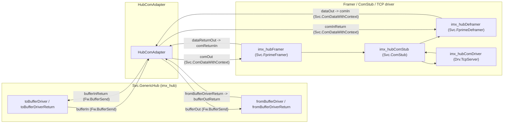
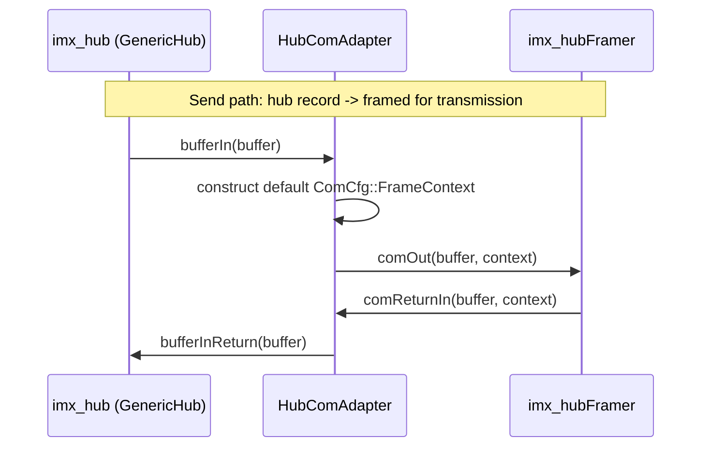
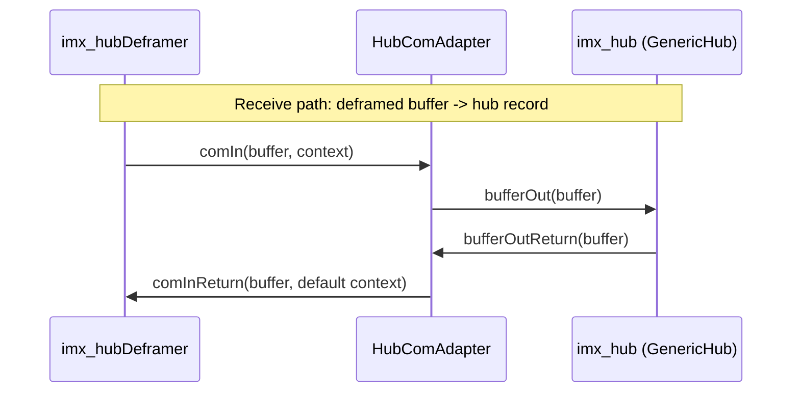

# scalesSvc::HubComAdapter

Stateless protocol adapter between `Svc.GenericHub` and the F Prime
framer/deframer/`Svc.ComStub` stack. It exists purely to bridge two
incompatible port families so GenericHub -- which only knows about plain
buffers -- can be framed, transmitted, received, and deframed by the
standard F Prime communications stack.

This document records the implemented component design, interfaces, and
verification status.

## Design Summary

`Svc.GenericHub` exchanges plain `Fw::Buffer` values over the `Fw.BufferSend`
port family (`toBufferDriver`/`toBufferDriverReturn` on the send side,
`fromBufferDriver`/`fromBufferDriverReturn` on the receive side). The F
Prime framer/deframer stack (`Svc.FprimeFramer`, `Svc.FprimeDeframer`)
instead exchanges `Svc.ComDataWithContext`, i.e. a buffer paired with a
`ComCfg::FrameContext` the framer/deframer needs. GenericHub has no concept
of that context. `HubComAdapter` is the shim in between: on the send side it
manufactures a default-constructed `ComCfg::FrameContext` when handing a hub
buffer to the framer; on the receive side it discards the `FrameContext`
when handing a deframed buffer back to the hub.

The component is `passive` and holds no state between calls: every handler
is a direct, single-line pass-through (see `HubComAdapter.cpp`). It defines
no commands, events, telemetry, or parameters, and (unlike most F Prime
components) has no standard AC ports at all (no `time get`, `command
recv`/`reg`/`resp`, `event`, `telemetry`, or `param` ports) -- there is
nothing here that needs the framework's logging/command/parameter
infrastructure, and no boilerplate is included for machinery this component
never uses.

The `comIn` port (receive direction, hub-bound) is `guarded` rather than
`sync`; the other three handlers are `sync`. This suggests `comIn` may be
invoked from a different calling context/thread than the send-path ports,
and the framework-provided mutex guard protects the (stateless) handler from
concurrent reentry. No shared state actually needs protecting today since
each handler only touches its own local `FrameContext` and immediately
forwards -- but the guard is cheap and matches the safer default for a
receive path whose caller isn't guaranteed to be the same thread as the
send path's callers.

## Functional Diagrams

### Component Relationships

### Send and Receive Sequences

## Operating Rules

1. Every buffer handed to `bufferIn` is forwarded to `comOut` unchanged,
   paired with a freshly default-constructed `ComCfg::FrameContext` (the
   adapter does not populate or interpret context fields).
2. Every buffer returned via `comReturnIn` is forwarded to `bufferInReturn`
   unchanged; the `FrameContext` on the return path is not used.
3. Every buffer delivered via `comIn` is forwarded to `bufferOut` unchanged;
   the incoming `FrameContext` is not used.
4. Every buffer returned via `bufferOutReturn` is forwarded to
   `comInReturn` unchanged, paired with a freshly default-constructed
   `ComCfg::FrameContext`.
5. No buffer is copied, inspected, queued, or dropped. The adapter performs
   no error handling of its own; a malformed or zero-length buffer is passed
   through exactly as received; correctness of the buffer's contents is the
   responsibility of `GenericHub` and the framer/deframer stack.

## Implementation Progress

- [x] Define the four pass-through handlers (`bufferIn`, `comReturnIn`,
  `comIn`, `bufferOutReturn`) bridging `Fw.BufferSend` and
  `Svc.ComDataWithContext`.
- [x] Wire both directions into the i.MX hub topology (`send_hub` and
  `recv_hub` connection blocks in `ImxDeployment/Top/topology.fpp`).
- [ ] No unit tests exist for this component (`test/ut/` is absent; the
  `CMakeLists.txt` has no `register_fprime_ut` block). Given each handler is
  a one-line pass-through, the risk of a regression is low, but there is
  currently no automated check that a buffer/context pair survives the
  round trip unchanged, or that ownership (`*Return` ports) is always
  returned to the correct originating side. Recommended follow-up: a small
  `HubComAdapterTester` asserting each of the four handlers forwards its
  argument(s) unchanged to the corresponding output port exactly once.

## Component Relationships

The deployment topology wires `HubComAdapter` symmetrically into both
directions of the i.MX hub's communications stack: `imx_hub` on one side
(`Fw.BufferSend`), and `imx_hubFramer`/`imx_hubDeframer` (which in turn talk
to `imx_hubComStub` and `imx_hubComDriver`) on the other
(`Svc.ComDataWithContext`). The authoritative wiring is in
`ImxDeployment/Top/topology.fpp`'s `send_hub` and `recv_hub` connection
blocks; the instance itself (`imx_hubComAdapter`) is declared in
`ImxDeployment/Top/instances.fpp`.

## Port Descriptions
| Name | Description |
|---|---|
| `bufferIn` | Buffer from `GenericHub` to be framed and transmitted. |
| `bufferInReturn` | Returns ownership of a `bufferIn` buffer once the framer stack is done with it. |
| `comOut` | Forwards a hub buffer (with a default `FrameContext`) into the framer. |
| `comReturnIn` | Receives a buffer back from the framer once it has been consumed. |
| `comIn` | Receives a deframed buffer (with `FrameContext`) from the communications stack. Guarded, not sync. |
| `comInReturn` | Returns a consumed deframed buffer (with a default `FrameContext`) to the deframer. |
| `bufferOut` | Forwards a deframed buffer into `GenericHub`. |
| `bufferOutReturn` | Receives a consumed buffer back from `GenericHub`. |

## Component States
| Name | Description |
|---|---|
| None | `HubComAdapter` is stateless; it holds no member state and has no internal modes. |

## Parameters
| Name | Description |
|---|---|
| None | `HubComAdapter` has no configurable parameters. |

## Commands
| Name | Description |
|---|---|
| None | `HubComAdapter` has no commands (no `command recv` port). |

## Events
| Name | Description |
|---|---|
| None | `HubComAdapter` has no events (no `event` port). |

## Telemetry
| Name | Description |
|---|---|
| None | `HubComAdapter` has no telemetry (no `telemetry` port). |

## Unit Tests
| Name | Description | Output | Coverage |
|---|---|---|---|
| None | No `test/ut/` directory or `register_fprime_ut` target exists for this component today. | -- | -- |

## Requirements
| Name | Description | Validation |
|---|---|---|
| HCA-001 | A buffer received on `bufferIn` shall be forwarded to `comOut` unchanged, paired with a default `FrameContext`. | Verified by code inspection (`HubComAdapter.cpp`); no automated test exists |
| HCA-002 | A buffer received on `comReturnIn` shall be forwarded to `bufferInReturn` unchanged. | Verified by code inspection; no automated test exists |
| HCA-003 | A buffer received on `comIn` shall be forwarded to `bufferOut` unchanged. | Verified by code inspection; no automated test exists |
| HCA-004 | A buffer received on `bufferOutReturn` shall be forwarded to `comInReturn` unchanged, paired with a default `FrameContext`. | Verified by code inspection; no automated test exists |

## Change Log
| Date | Description |
|---|---|
| 2026-07-27 | Initial SDD documenting the implemented pass-through adapter, its topology wiring, and the current absence of unit test coverage. No functional changes; this is a documentation-only pass. |
