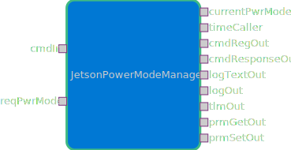

# scalesSvc::JetsonPowerModeManager

Controls configuration, enabling state transitions and power cycle operations

## Usage Examples
The `JetsonPowerModeManager` component is used to control the power mode of the Jetson device. It provides capabilities to set different power modes (15W, 30W, 50W) through the `nvpmodel` commands built into the Jetson.

## Requirements
| Name | Description | Validation |
|---|---|---|
| JPSM-001 | The `JetsonPowerModeManager` component shall obtain the current power mode from the Jetson. |---|
| JPSM-002 | The `JetsonPowerModeManager` component shall provide commands to change the power mode of the Jetson. |---|
| JPSM-003 | The `JetsonPowerModeManager` component shall verify that the Jetson power mode changed successfully after a change request. |---|

### Diagrams

### Typical Usage
1. The component is initialized with default power mode configurations.
2. Power modes can be changed via an F Prime command.
3. The Jetson will boot into Minimal mode (15W) by default.
4. The Jetson will restart after running the command to switch modes, so there must be another component monitoring `JetsonPowerModeManager` to validate the new mode switch after the Jetson boots up again.

## Class Diagram
Add a class diagram here

## Port Descriptions
| Kind | Name | Description |
|---|---|---|
| anync input | powerModeRecieve | Port for receiving power mode change requests |
| output | powerModeSend | Port for sending current power mode information |

## Component States

State machine will either be implemented here or in `scalesSvc::SpacecraftStateManager`. See the [SpacecraftstateManager sdd](https://github.com/BroncoSpace-Lab/fprime-scales/tree/kellydev/scales/scalesSvc/SpacecraftStateManager) for more information on the HPC state machine.

| Name | Description |
|---|---|
| Minimal | 15W power mode on the Jetson. Able to do basic tasks while minimizing power consumption. Default HPC mode. |
| Balanced | 30W power mode on the Jetson. Can complete more computationally intensive tasks than in Minimal HPC Mode, but still managing power consumption. |
| Extra | 50W power mode on the Jetson. Most performance possible while capping power consumption on the Jetson. |
| Maximum | MAXN power mode on the Jetson. Absolute maximum in both power consumption and performance. Best for intense computations or operations. |

## Parameters
| Name | description |
|---|---|
| PWR_MODE_REQ | Parameter to save the most recently requested power mode to check after switching modes. |

## Commands
| Name | Description |
|---|---|
| SET_POWER_MODE | Command to set the Jetson power mode |
| GET_POWER_MODE | Command to request current power mode |

## Events
| Name | Description |
|---|---|
| POWER_MODE_REQUEST_RECEIVED | Event emitted when a power mode change request arrives via the hub port (from `scalesSvc::PowerManager`) |
| POWER_MODE_CHANGED | Event indicating power mode change successful |
| POWER_MODE_CHANGE_FAILED | Event indicating power mode change failed |

## Telemetry
| Name | Description |
|---|---|
| CurrentPowerMode | Current power mode of Jetson (15W, 30W, 50W, or MAXN) |

## Change Log
| Date | Description |
|---|---|
| May 7, 2025 | Initial Draft |
| Devember 4, 2025 | Use nvpmodel to change modes |

